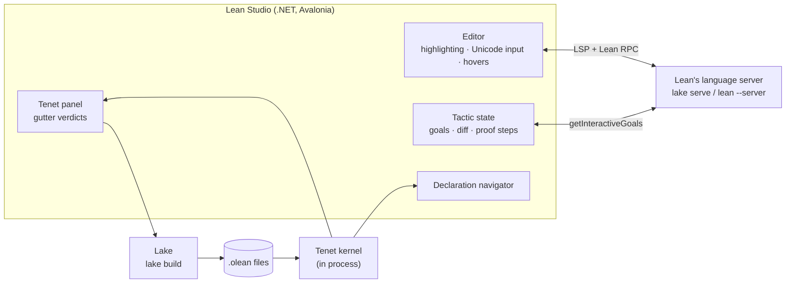

<p align="center">
  
</p>

<h1 align="center">Lean Studio</h1>

<p align="center">
  <b>A desktop IDE for Lean 4, on macOS, Windows and Linux.</b><br>
  Lean elaborates your proofs as you type. Tenet then re-checks each one it built.<br>
  Created by <b>Keith Adler</b>, <a href="https://x.com/keithadler">@keithadler</a> on X.
</p>

<p align="center">
  <a href="#install">Install</a> ·
  <a href="#features">Features</a> ·
  <a href="#how-it-works">How it works</a> ·
  <a href="#building-from-source">Build from source</a> ·
  <a href="#keyboard-shortcuts">Shortcuts</a>
</p>


Lean Studio is a native desktop app built only for Lean. It is not a plugin or a web view inside another editor. The tactic state gets a full panel. Every tactic in a proof is listed with what it changed. Each declaration you build gets a second, independent check from [Tenet](https://github.com/keithadler/tenet), a separate implementation of Lean's kernel.

## Features

### A tactic state that follows every step

The panel on the right always shows the goals at the cursor, **with Lean's own diff of the tactic you're on**:

- Hypotheses the tactic **added** have a green background.
- Hypotheses it **removed** are struck through.
- Goals it closes or opens are marked on the goal's card.

Below the goals, **Proof Steps** lists every tactic in the proof around the cursor. Each step shows how many goals are left after it and what it did, e.g. `+hp`, `−h`, `~hx`, `+1 goal`, `goals accomplished`. Steps that fail are shown in red. Click a step to jump to it. The step list is computed once per version of the proof, so moving the cursor through it is instant.

The panel also shows the **expected type** of the term under the cursor and the **messages** on the current line. A **Plain** toggle switches to the text Lean prints.

### Independent verification with Tenet


**Build** (⌘B / Ctrl+B) runs `lake build`. Tenet then re-checks every declaration Lean just compiled, using a kernel written separately from Lean's. Each declaration gets a badge in the gutter:

| Badge | Meaning |
|:-:|---|
| ✓ | Verified. It depends on nothing beyond `propext`, `Classical.choice` and `Quot.sound`. |
| ◐ | Rests on `sorry` or on an axiom your project introduces, and the panel names which one. |
| ✗ | Rejected by Tenet's kernel, with the kernel's reason. |

A green build tells you Lean accepted the file. These badges tell you whether each theorem is actually proved, and whether a second kernel agrees.

### A declaration navigator that reads the compiled library


The **Declarations** tab searches everything the project can see: your code, its dependencies (Mathlib included), and Lean's core library. It reads straight from the `.olean` files through Tenet, so it needs no language server and no re-elaboration. For each declaration it shows:

- the statement and docstring
- where it is defined, with a link to open the source
- **every axiom it rests on**, computed by Tenet (the same answer as `#print axioms`)
- what it uses, and what uses it

Press ⌘⇧D / Ctrl+Shift+D on any name in the editor to open it here.

### Everything else a Lean IDE needs

- **Lean-aware editor**:
  - Lean 4 syntax highlighting, with `sorry` flagged.
  - Squiggles under errors and warnings.
  - An amber gutter bar while Lean elaborates.
  - Hovers with type signatures and docstrings.
  - Completion (Ctrl+Space, or after `.`).
  - Go to definition (F12 or ⌘/Ctrl-click).
  - Toggle comments (⌘/ / Ctrl+/), find and replace, and go to line.
- **Unicode input**: type `\alpha`, `\to`, `\forall`, `\N`, `\<`, `\_1` and get `α → ∀ ℕ ⟨ ₁`.
  - About 430 abbreviations, with a pop-up list of matches as you type.
  - An abbreviation converts as soon as it can't be extended any further. Space or Tab converts it immediately.
- **Projects**:
  - Create a Lake project from a template: library, library plus executable, executable, or Mathlib library.
  - Open any folder or file.
  - Build, clean, update dependencies, and fetch Mathlib's prebuilt cache without leaving the app.
- **Toolchains**:
  - See what elan has installed, and install `stable`, `nightly` or any version.
  - Pin a toolchain to the project, which writes `lean-toolchain` and restarts Lean on it.
  - Set elan's default.

  
- **Problems** and **Output** panels, recent projects, and dark and light themes. Open files are restored the next time the app starts.

## Install

Lean Studio needs **[elan](https://github.com/leanprover/elan#installation)**, Lean's toolchain manager. elan is the standard way to install Lean, so you probably have it already. Lean Studio has the right Lean version for each project installed through it.

Download builds from the [Releases](../../releases) page:

| Platform | File |
|---|---|
| macOS (Apple silicon / Intel) | `LeanStudio-<version>-osx-arm64.zip` / `-osx-x64.zip` contains `Lean Studio.app` |
| Windows (x64 / ARM64) | `LeanStudio-<version>-win-x64.zip` / `-win-arm64.zip`: run `LeanStudio.exe` |
| Linux (x64 / ARM64) | `LeanStudio-<version>-linux-x64.tar.gz` / `-linux-arm64.tar.gz`: run `LeanStudio` |

The builds are self-contained, so nothing else needs installing. They aren't code-signed yet:

- **macOS**: right-click the app and choose **Open** the first time.
- **Windows**: choose **More info → Run anyway** in SmartScreen.

## How it works



Lean Studio divides the work so it never has to trust itself about Lean:

- **Elaboration is Lean's.** Lean Studio talks to Lean's own language server (`lake serve` in a Lake project, `lean --server` elsewhere) over LSP and Lean's RPC protocol. Goals come from `Lean.Widget.getInteractiveGoals`, which is where the before/after diff flags come from. So tactics, macros, notation and Mathlib behave exactly as they do under `lake build`.
- **Checking is Tenet's.** Tenet is an independent implementation of the Lean 4 kernel in C#, and it runs in the same process. It memory-maps the `.olean` files Lake produced and type-checks every declaration again. It also computes each declaration's axioms without relying on Lean's own `#print axioms`.

## Building from source

You need the [.NET 10 SDK](https://dotnet.microsoft.com/download) and elan.

```bash
git clone --recurse-submodules https://github.com/keithadler/leanstudio
```

```bash
cd leanstudio && dotnet run --project src/LeanStudio.App
```

You can pass a folder or a `.lean` file as an argument to open it on start: `dotnet run --project src/LeanStudio.App -- path/to/project`.

To build a self-contained release for one platform:

```bash
packaging/publish.sh osx-arm64
```

The runtime IDs are `osx-arm64`, `osx-x64`, `win-x64`, `win-arm64`, `linux-x64` and `linux-arm64`. The zip or tarball lands in `artifacts/`; on macOS the script also assembles `Lean Studio.app`.

### Tests

```bash
dotnet test --project tests/LeanStudio.Tests
```

The tests run against a **real Lean server** and a **real Lake build**. They start `lean --server`, check the goals, hypotheses and diff flags at known positions, build `samples/Proofs`, and confirm Tenet's verdicts on it. When Lean isn't installed, the tests that need it are skipped.

```bash
dotnet run --project tools/LeanStudio.Snapshot -- . snapshots
```

This drives the **whole app** without a display, against a live Lean server. It opens a project, waits for elaboration, reads the goals, builds, verifies with Tenet, searches the navigator and types Unicode abbreviations. It saves a screenshot at each stage (the images in this README come from it) and fails if anything doesn't behave. CI runs it on macOS and Linux.

### Layout

| Path | What it is |
|---|---|
| `src/LeanStudio.Lsp` | JSON-RPC and LSP client for Lean's server, including Lean's goal and RPC extensions |
| `src/LeanStudio.Core` | Projects, Lake, elan, proof-step analysis, Unicode abbreviations, and Tenet verification and navigation |
| `src/LeanStudio.App` | The Avalonia desktop app |
| `tests/LeanStudio.Tests` | Unit tests and integration tests against real Lean |
| `tools/LeanStudio.Snapshot` | Headless end-to-end run with screenshots |
| `external/tenet` | [Tenet](https://github.com/keithadler/tenet), as a git submodule |
| `samples/` | Small Lean projects the tests and snapshots use |
| `packaging/` | Release scripts, the macOS bundle template, icons, the Linux desktop entry |

## Keyboard shortcuts

| Action | macOS | Windows / Linux |
|---|---|---|
| Build | ⌘B | Ctrl+B |
| Verify with Tenet | ⌘⇧V | Ctrl+Shift+V |
| Go to definition | F12 or ⌘-click | F12 or Ctrl-click |
| Show declaration in navigator | ⌘⇧D | Ctrl+Shift+D |
| Completion | Ctrl+Space | Ctrl+Space |
| Toggle comment | ⌘/ | Ctrl+/ |
| Restart Lean | ⌘⇧R | Ctrl+Shift+R |
| Save / Save all | ⌘S / ⌘⇧S | Ctrl+S / Ctrl+Shift+S |
| Open file / New file / Close | ⌘O / ⌘N / ⌘W | Ctrl+O / Ctrl+N / Ctrl+W |
| Find / Go to line | ⌘F / ⌘L | Ctrl+F / Ctrl+G |

## Status

Lean Studio is at **0.1**, the first release. The whole workflow works end to end and is tested against real Lean 4.34. It has been used by hand on macOS; on Windows and Linux it is built and tested by CI. Known gaps:

- Goals are shown as text. You can't yet hover a subterm inside a goal to see its type.
- ProofWidgets and other user widgets aren't rendered.
- Tenet's badges describe the last build. After you edit a file, rebuild to refresh them.
- Release builds aren't signed or notarized.

## Author

Lean Studio is created and maintained by **Keith Adler**, [@keithadler](https://x.com/keithadler) on X, who also wrote [Tenet](https://github.com/keithadler/tenet). Follow him there for updates.

## License

[MIT](LICENSE). Tenet, included as a submodule, is MIT OR Apache-2.0.
