<p align="center">
  
</p>

<h1 align="center">Lean Studio</h1>

<p align="center">
  <b>A desktop IDE for Lean 4, on macOS, Windows and Linux.</b><br>
  Lean elaborates your proofs as you type. Tenet then re-checks each one it built.<br>
  Created by <b>Keith Adler</b>, <a href="https://x.com/keithadler">@keithadler</a> on X.
</p>

<p align="center">
  <a href="#install">Install</a> ·
  <a href="#how-it-compares">Compared with VS Code</a> ·
  <a href="#new-to-lean">New to Lean?</a> ·
  <a href="#features">Features</a> ·
  <a href="#use-it-with-ai-assistants">AI assistants</a> ·
  <a href="#how-it-works">How it works</a> ·
  <a href="#building-from-source">Build from source</a> ·
  <a href="#keyboard-shortcuts">Shortcuts</a> ·
  <a href="#documentation">Docs</a>
</p>

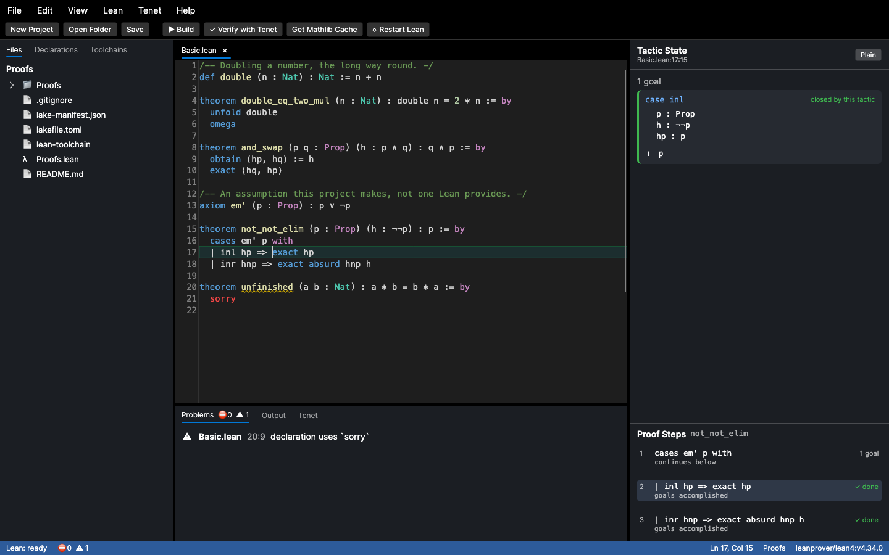

Lean Studio is a native desktop app built only for Lean. It is not a plugin or a web view inside another editor. The tactic state gets a full panel. Every tactic in a proof is listed with what it changed. Each declaration you build gets a second, independent check from [Tenet](https://github.com/keithadler/tenet), a separate implementation of Lean's kernel.

## How it compares

Most people write Lean in VS Code with the official lean4 extension, and it's very good. Here's what Lean Studio has, side by side:

| | VS Code + lean4 | Lean Studio |
|---|:---:|:---:|
| Goals and messages as you type, go to definition, hover, completion, rename, references | ✓ | ✓ |
| Unicode input (`\alpha`), semantic highlighting, inlay hints, call hierarchy, trace trees | ✓ | ✓ |
| Every step of a proof listed with what it changed | | ✓ |
| Prove It: a portfolio of tactics tried on each `sorry`, with counterexamples when the goal is false | | ✓ |
| Extract a goal as a lemma, with the hypotheses it needs | | ✓ |
| Independent re-checking of every declaration by a second kernel (Tenet) | | ✓ |
| Why a theorem isn't fully proved, and a map of what rests on `sorry` | | ✓ |
| Per-declaration timing from Lean's profiler | | ✓ |
| Search Mathlib in plain English, and Loogle, built in | | ✓ |
| Proof walkthroughs as web pages; share links to the web editor | | ✓ |
| A tutorial, goals read in English, errors explained, for people new to Lean | | ✓ |
| C FFI: `@[extern]` checked against the C code, stubs, clangd | | ✓ |
| An MCP server so AI assistants can use Lean | | ✓ |
| ProofWidgets and other JavaScript widgets in the infoview | ✓ | ✓ (Lean's own infoview, in the browser) |
| Vim mode | ✓ (an extension) | ✓ built in |
| The VS Code ecosystem: its other extensions, remote development | ✓ | |

Lean Studio is tested against real Lean on macOS, Windows and Linux on every change, and against a real Mathlib project every week.

## New to Lean?

Lean Studio is built to be the place to start, whether you're curious about theorems or you write code:

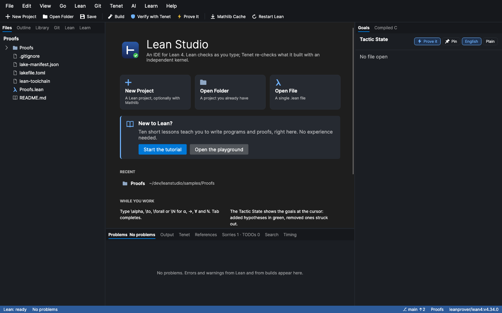

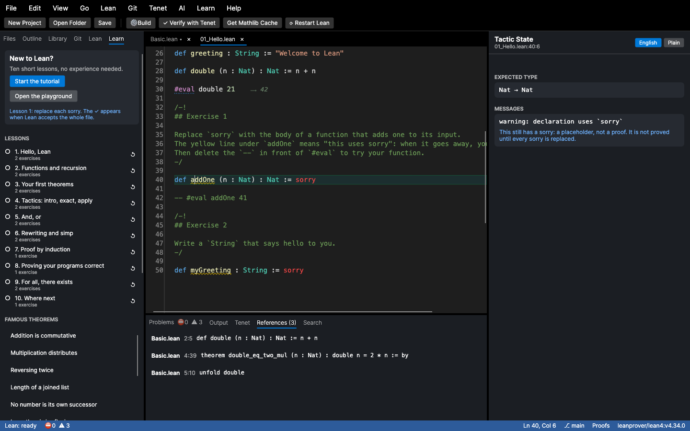

1. **A tutorial inside the editor.** Ten short lessons, in Lean files, from `#eval 2 + 2` to proofs by induction and proving your own programs correct. Each ends in exercises (`sorry`s to replace), and the Learn tab ticks a lesson off when Lean accepts it. Every exercise is checked against real Lean by the tests, so none is impossible.
2. **Every tactic and keyword explained.** Hover `intro`, `simp`, `omega` or `theorem` for what it does, in plain words, with an example. The Proof Steps list explains each step's tactic too.
3. **Errors in plain words.** Under Lean's message, "What this means" gives the gist of "unsolved goals", "type mismatch", "unknown identifier" and more than twenty others, and what to try.
4. **Goals read aloud.** Under each goal: "In words: For all propositions p and q: if p and q, then q and p."
5. **A playground.** One click opens a Lean file to experiment in, with no project to set up.
6. **Famous theorems.** Addition is commutative, reversing a list twice, the law of excluded middle, and, with Mathlib, infinitely many primes and √2 is irrational. Each comes with a plain English statement, and "Try it in Lean" shows its exact statement and the axioms it rests on.
7. **Results inline.** `#eval`, `#check` and `#print` results appear at the end of their line, like a notebook.
8. **▶ Run.** A file with a `main` gets a Run button; the program's output shows in Output.
9. **Snippets.** Insert a function, a structure, a pattern match, a proof by induction, a `calc` chain or a program's `main`, indented and ready to fill in.
10. **A symbol palette.** Click ∀ ∃ → ℕ ⟨⟩ and the rest to insert them, and see how to type each one. Hover any symbol in your code for the same.

The Outline also shows, live, which theorems Lean accepts (✓), which still use `sorry` (◐) and which have errors (✗).

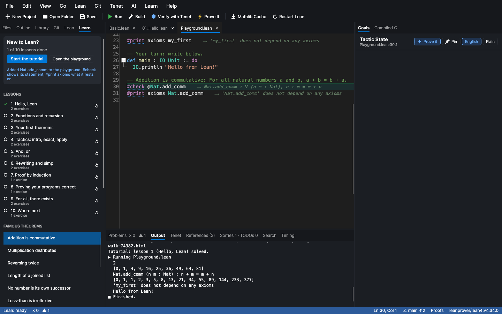

## Features

### Five things other Lean editors don't do

1. **⚡ Prove It.** Put the cursor on a `sorry` and press ⌘⌥P (Ctrl+Alt+P), or click **⚡ Prove it** in the Tactic State. Lean Studio tries `rfl`, `decide`, `simp`, `omega`, `norm_num`, `ring`, `linarith`, `nlinarith`, `positivity`, `aesop`, `grind`, `exact?` and more on that goal. Each tactic runs separately from the same state, with its own time budget, in a single pass of Lean. You see every one that closes the goal and how long it took; one click puts it in place of the `sorry`. **Every sorry in the file** does the whole file at once, and **Fill in every sorry it proved** applies them all. A search tactic like `exact?` is replaced by what it found (`exact Nat.mul_comm a b`), so the proof doesn't search again on every check. Tactics that your imports don't provide (Mathlib's, in a file without Mathlib) are skipped rather than breaking anything.

   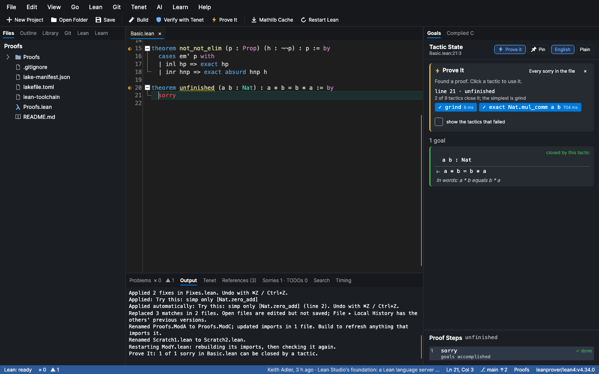

2. **Why isn't this proved?** When Tenet says a theorem rests on `sorry` or on an axiom, **Why?** (in the Tenet panel, from the ◐ badge in the gutter, or from **Tenet ▸ Why Isn't This Proved?**) shows the chain of lemmas from that theorem down to the `sorry`. It finds the shortest chain through what each declaration uses, and marks the lemma that uses the `sorry` itself. Every link opens its source. In a big project, it answers "which lemma, three files away, is still unfinished?" in one click.

   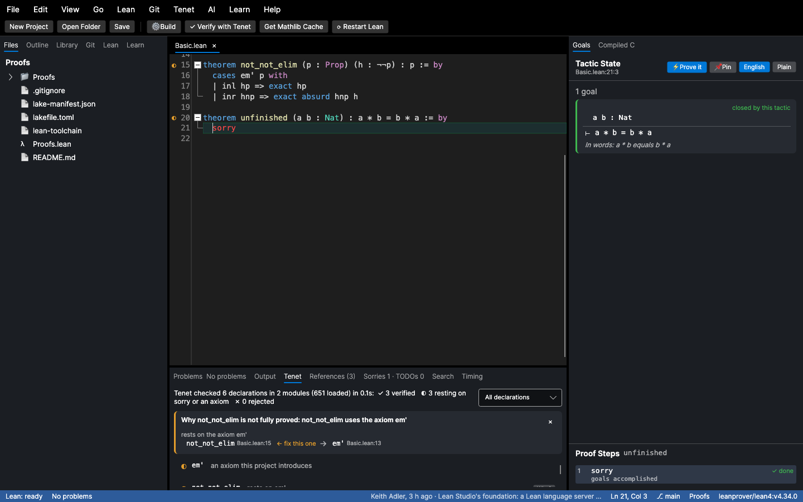

3. **A performance heat map.** **Lean ▸ Profile File** runs Lean's own profiler over the file and lists every declaration by how long it takes to check, slowest first. For each one it names the step inside that costs the most (`omega`, a `simp` call, the kernel). The times are also shown in the editor on each declaration, tinted warmer the slower it is. It profiles unsaved text, and your file is never modified.

   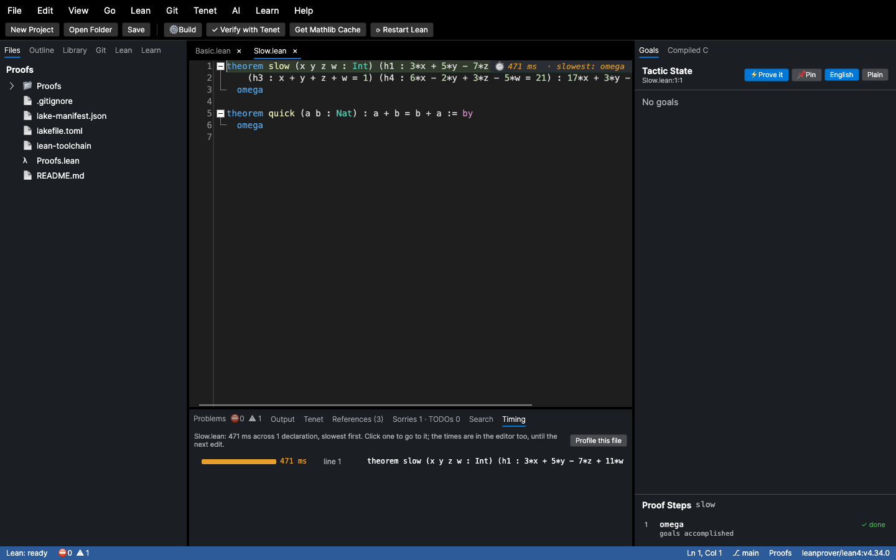

4. **Proof walkthroughs and share links.** **File ▸ Export Proof Walkthrough…** writes every tactic proof in the file to one self-contained web page, step by step. Each step shows the tactic, what it does in plain words, and the goals before and after, exactly as Lean reported them. You can step through with ← and →. It works for a class handout, a blog post or a code review, and readers don't need Lean installed. **Open in the Lean 4 Web Editor** and **Copy Share Link** give a link that runs the file at [live.lean-lang.org](https://live.lean-lang.org), which has Mathlib.
5. **Ask Mathlib in plain English.** The Library panel takes a description, such as "the sum of the first n odd numbers is n squared" or "a continuous function on a closed interval attains its maximum". It returns the Mathlib results that say that, with their informal statements, using [LeanSearch](https://leansearch.net). Loogle (below it) finds what you can name or write the shape of. This finds what you can only describe.

AI assistants get all five too: the `prove`, `why_not_proved`, `profile`, `export_walkthrough` and `search_mathlib` tools.

### And four more for real proof work

1. **"Is this even true?"** When no tactic closes a goal, Prove It looks for a counterexample. It tries small values of the goal's `Nat`, `Int` and `Bool` variables (and runs [Plausible](https://github.com/leanprover-community/plausible) where the project has it). If it finds values that satisfy every hypothesis and make the goal false, it says so ("✗ False when n = 4"). You find out the statement is wrong before spending an afternoon trying to prove it.

   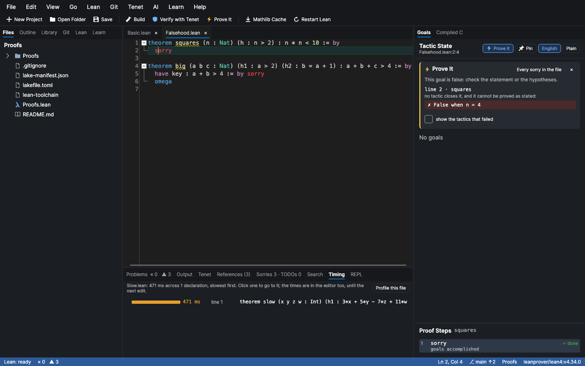

2. **Extract Goal as Lemma** (Lean ▸ Extract Goal as Lemma…, or from Prove It). Put the cursor on a `sorry` and its goal becomes a lemma of its own above the declaration, and the `sorry` becomes a use of it. Lean works out which hypotheses the goal needs, and prints the signature the way a person would write it:

   ```lean
   theorem key_step {a b : Nat} (h1 : a > 2) (h2 : b = a + 1) : a + b > 4 := by
     sorry
   ```

   It's the way to break up a long proof, or to set a hard step aside and come back to it. One undo takes it back.
3. **A REPL** (⌘⌥R / Ctrl+Alt+R). Type an expression or a command and Lean evaluates it in the file at the cursor, with everything above it in scope: your definitions, imports, namespaces and variables. Bare expressions are `#eval`ed, and ↑ / ↓ recall earlier inputs. It keeps one document open in Lean, so only the new input is checked each time.

   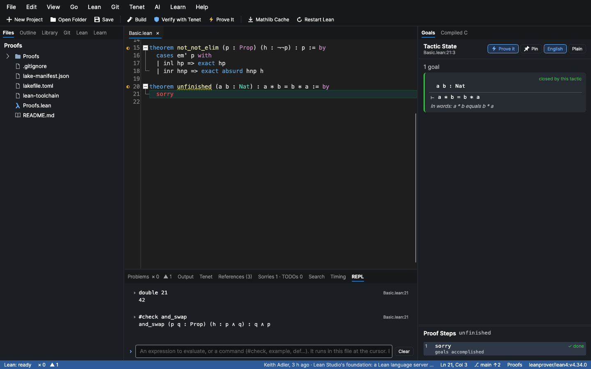

4. **Project Map** (Tenet ▸ Project Map…). The whole project as a graph: every declaration, what it uses, and whether it's fully proved (green), rests on `sorry` (amber), or rests on an axiom (purple). Columns run from foundations on the left to what builds on them. **Fix these first** lists the sorries and axioms that the most declarations depend on. Hover shows details, and a click opens the declaration.

   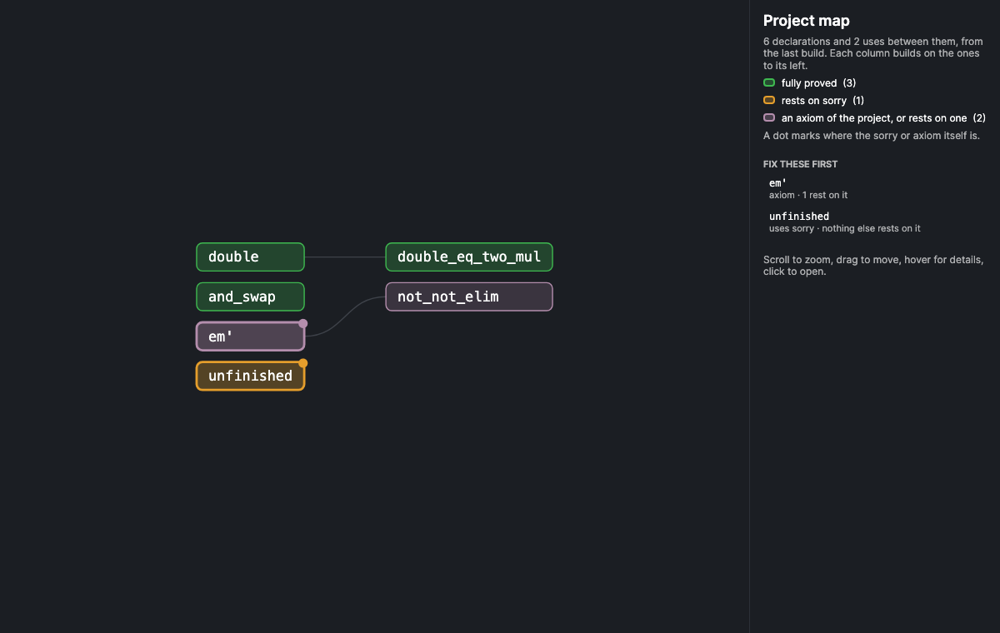

Assistants get these through the `extract_lemma` and `project_map` tools, and through `prove`, which now reports counterexamples.

### C and Lean's FFI

For Lean code that calls C (`@[extern "c_name"]`):

- **Go to definition crosses the boundary.** F12 on an `@[extern]` declaration opens its C function. F12 on that C function opens the Lean declaration it implements.
- **Bindings are checked.** Problems flags an `@[extern]` whose C function the project doesn't have. It also flags a C function that takes a different number of arguments than Lean passes, which is easy to get wrong with `IO` functions and their extra world argument. Lean's own runtime functions (`lean_*`) are left alone.
- **C stubs with the right signature.** *Lean ▸ C and FFI ▸ Write C Stub for This Extern* writes the C function Lean expects:
  - scalar types (`UInt32`, `UInt64`, `Float`, `Bool`…) unboxed;
  - objects as `lean_obj_arg`, or `b_lean_obj_arg` when borrowed with `@&`;
  - the world argument and `lean_io_result_mk_ok` for `IO`.

  *New C Binding…* writes both sides from a name and a type. The tests compile these stubs with Lean's own C compiler, with `-Wall -Werror`.
- **clangd for the C files**, when it's installed. It adds errors as you type, hover, completion and go to definition. Lean's headers are on its include path, so `#include <lean/lean.h>` just works, and nothing is written into your project.

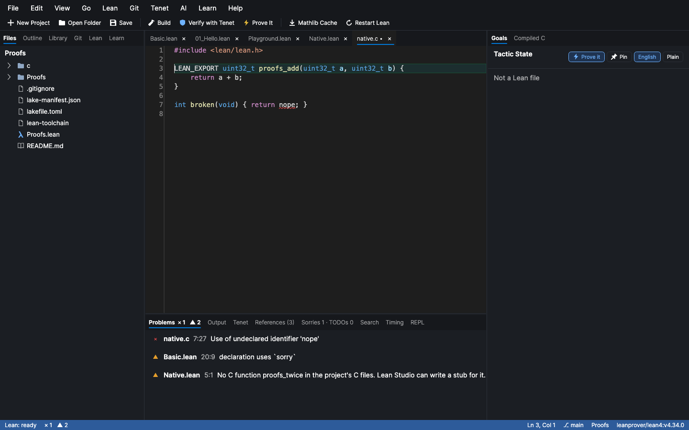

### A tactic state that follows every step

The panel on the right always shows the goals at the cursor, **with Lean's own diff of the tactic you're on**:

- Hypotheses the tactic **added** have a green background.
- Hypotheses it **removed** are struck through.
- Goals it closes or opens are marked on the goal's card.

Below the goals, **Proof Steps** lists every tactic in the proof around the cursor. Each step shows how many goals are left after it and what it did, e.g. `+hp`, `−h`, `~hx`, `+1 goal`, `goals accomplished`. Steps that fail are shown in red. Click a step to jump to it. The step list is computed once per version of the proof, so moving the cursor through it is instant.

The panel also shows the **expected type** of the term under the cursor and the **messages** on the current line. A **Plain** toggle switches to the text Lean prints.

### Independent verification with Tenet

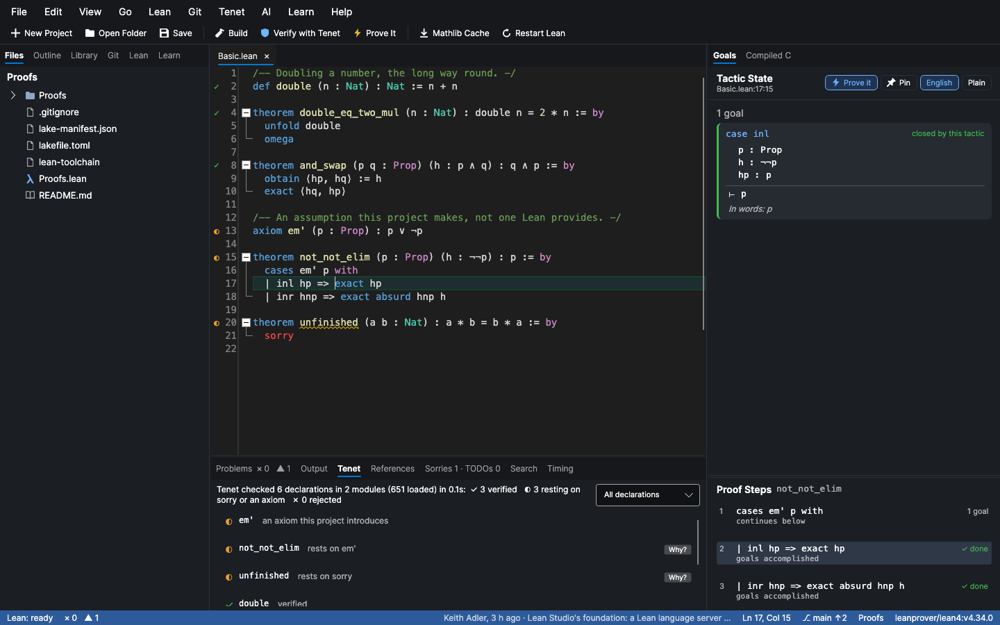

**Build** (⌘B / Ctrl+B) runs `lake build`. Tenet then re-checks every declaration Lean just compiled, using a kernel written separately from Lean's. Each declaration gets a badge in the gutter:

| Badge | Meaning |
|:-:|---|
| ✓ | Verified. It depends on nothing beyond `propext`, `Classical.choice` and `Quot.sound`. |
| ◐ | Rests on `sorry` or on an axiom your project introduces, and the panel names which one. |
| ✗ | Rejected by Tenet's kernel, with the kernel's reason. |

A green build tells you Lean accepted the file. These badges tell you whether each theorem is actually proved, and whether a second kernel agrees.

### A declaration navigator that reads the compiled library

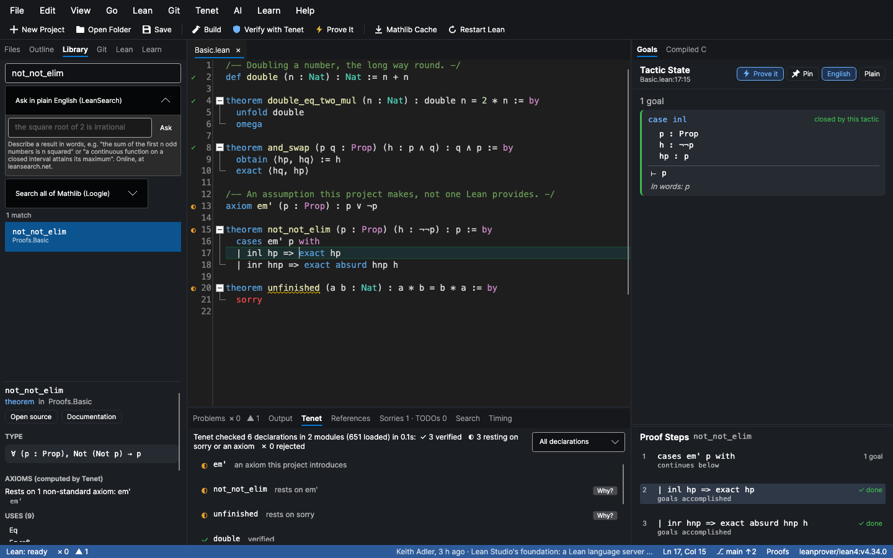

The **Library** tab searches everything the project can see: your code, its dependencies (Mathlib included), and Lean's core library. It reads straight from the `.olean` files through Tenet, so it needs no language server and no re-elaboration. For each declaration it shows:

- the statement and docstring
- where it is defined, with a link to open the source
- **every axiom it rests on**, computed by Tenet (the same answer as `#print axioms`)
- what it uses, and what uses it

Press ⌘⇧D / Ctrl+Shift+D on any name in the editor to open it here.

### Try this, with one click

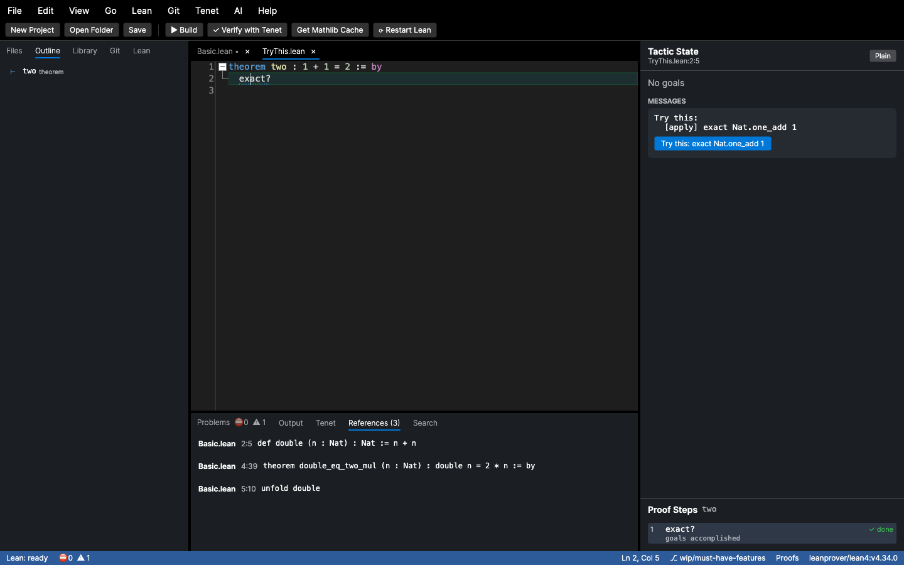

Write `exact?`, `apply?`, `simp?` or `rw?` where a proof is stuck. When Lean finds something, its "Try this" suggestion appears in the tactic state as a button, and clicking it puts the suggestion into your proof. ⌘. / Ctrl+. lists every suggestion and quick fix at the cursor.

### Git and GitHub

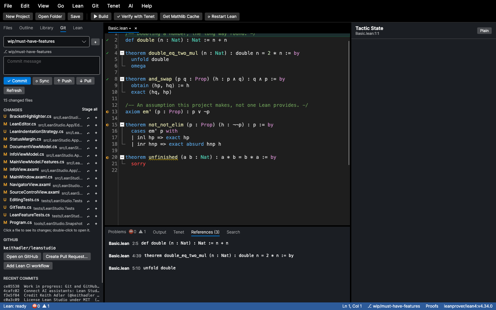

The **Git** tab is built on your own `git`, so your config, hooks, credentials and commit signing all apply:
- **Branch and changes:** the current branch, with how far it is ahead of or behind upstream, and the changed files. Click a file for its diff; stage, unstage or discard each one.
- **Commit and sync:** commit (with nothing staged, everything is committed), push, pull and sync. Switch or create branches, and see recent history.
- **Gutter:** a bar marks the lines you've changed since the last commit, green for added, blue for modified and red for deleted.
- **Status bar:** shows the branch; click it to open the panel.

GitHub works through the [GitHub CLI](https://cli.github.com) (`gh`), so your login is used and Lean Studio never sees a token:
- **Clone:** File ▸ Clone Repository… takes `owner/repo` or a URL. For a Mathlib project, it offers to download Mathlib's prebuilt files.
- **Publish to GitHub:** creates a private repository and pushes to it.
- **Create Pull Request:** pushes the branch first if it needs to, then shows the PR's link in the panel.
- **Open on GitHub:** jumps to the current file and line on github.com.
- **Add Lean CI Workflow:** writes the standard `leanprover/lean-action` workflow, so every push is built.

### See the C, look inside goals

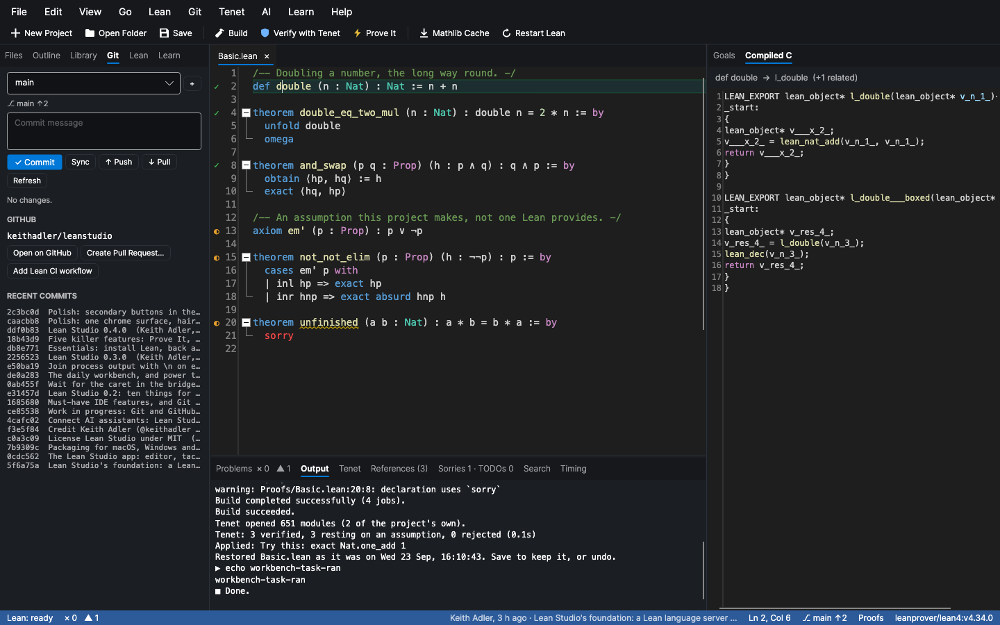

- **Compiled C, side by side.** The Compiled C tab, beside the editor, shows the C that Lean's compiler emits for the definition under the cursor: its function (`Foo.bar` becomes `l_Foo_bar`), its boxed wrapper and any helpers split off it. It follows the cursor, and compiles the text as it is in the editor, saved or not. Theorems say they have no code, since proofs are erased.
- **Subterms you can inspect.** Move the pointer over a goal and the smallest subterm under it lights up. Rest there, and Lean says what it is: its type, the term written out in full, and its documentation.
- **Pinned goals.** 📌 keeps a goal state on screen while you work elsewhere, so you can compare.

### Fixes, one at a time or all at once

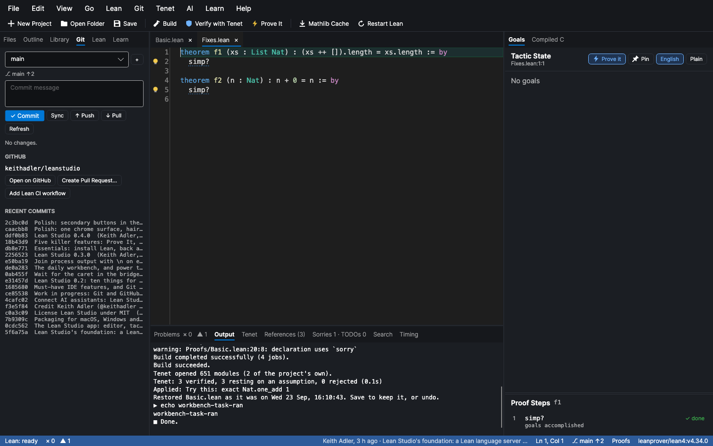

- **Lightbulbs.** A bulb marks each line where Lean offers a fix: a "Try this", or a hint marked [apply], such as an unused `simp` argument. Click it for the fixes.
- **Fix All in File** (⌘⌥. / Ctrl+Alt+.) applies one fix for every message that has one, as a single undoable edit.
- **Automatic fixes** (Lean ▸ Apply Lean's Suggestions Automatically) is off by default. When on, it puts the answer in as soon as an `exact?`, `simp?` or `apply?` you wrote finds exactly one.

### Built for daily work

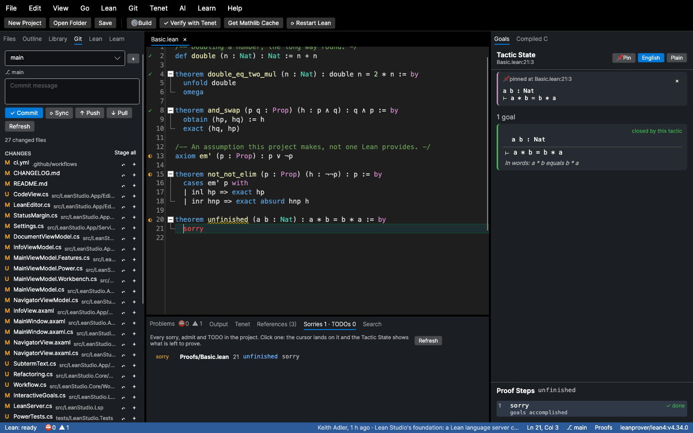

- **Sorries & TODOs.** A panel lists every `sorry`, `admit` and TODO in the project, with its declaration, including files you haven't opened. Click one: the cursor lands on it, and the tactic state shows what's left to prove there.
- **Whole-project problems.** After a build, errors and warnings from every file appear in Problems, not just from open files.
- **Auto-save and local history.** With File ▸ Auto Save on, files save a moment after you stop typing and when the window loses focus. Every save keeps a version (the last 40 per file), and File ▸ Local History brings one back as an edit you can undo.
- **Search and replace across files,** with regex groups (`$1`). Open files are changed in the editor, unsaved, for review; other files keep their previous version in local history.
- **Refactoring.** Rename a symbol across the project (F2, through Lean). Rename a module, which moves the file and rewrites every `import` of it.
- **Loogle.** Search all of Mathlib by name or by the shape of a type (`_ * (_ ^ _)`, `|- tsum _ = _`) from the Library tab. The Library also links any declaration to its documentation page.
- **Blame.** The status bar says who last changed the current line, when, and in which commit.
- **Tasks.** ⌘⇧B / Ctrl+Shift+B runs `lake build`, `lake test`, `lake lint`, any executable or Lake script; Lean ▸ Run Shell Command runs anything else in the project.
- **Getting around.** Back and Forward after any jump (⌃- / ⌃⇧- on macOS, Alt+← / Alt+→ elsewhere). F8 and ⇧F8 go to the next and previous problem.
- **Imports that changed.** When a file you import changes, a banner offers to rebuild the imports and check the file again (what other editors call Restart File).
- **Add import.** On an "unknown identifier", the lightbulb looks the name up on Loogle and offers `import` of the module that defines it.
- **Files.** Right-click in Files to create a file or folder, rename (a Lean file is renamed as a module, imports and all), move to the trash, reveal it, open a terminal there, or copy its path. Drop files or a folder on the window to open them.
- **Settings, windows, resilience.** Preferences (⌘, / Ctrl+,) has every setting in one place. File ▸ New Window opens a second project. If Lean crashes it is started again, and an unexpected error is logged instead of closing the app.
- **Your layout.** Hide the sidebar (⌘⌥B), the bottom panel (⌘J) or the goals (⌘⌥I), or use zen mode (⌘⌥Z) for just the editor and the goals. There's also word wrap (⌥Z). Each file reopens with the cursor where you left it, and the file you were on comes back when the app starts.

### The editor knows what Lean knows

- **Semantic highlighting.** Bound variables and fields are coloured as Lean classifies them, which a grammar can't do. Deprecated names are struck through.
- **Inlay hints.** What Lean fills in for you shows in the text, dimmed and boxed, such as `{α}` for a type variable it binds automatically.
- **Every use of the name under the cursor** is highlighted, by Lean's own resolution rather than a text search.
- **Who Uses This / What This Uses** (⌘⌥H / Ctrl+Alt+H). Lean's call hierarchy lists every declaration that uses the one at the cursor, at the place it uses it, and everything it uses.
- **Trace trees.** A message from `set_option trace.… true` is a tree you expand one step at a time in the Tactic State. Lean sends each level only when you open it, so even huge traces (instance search, `simp`) stay fast. Failed steps are marked in red.

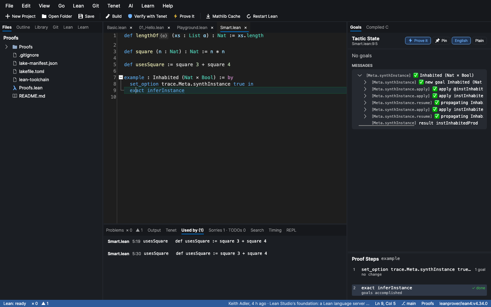

### Lean's own infoview, widgets and all

*View ▸ Lean Infoview in Browser* opens the infoview VS Code uses (the official `@leanprover/infoview`) in a browser tab. It's connected to Lean Studio, follows the cursor there, and renders what that infoview renders. That includes user widgets such as those from **ProofWidgets**, because it's the same infoview loading them the same way. The tests check a widget defined in a Lean file. It shares Lean Studio's Lean server, so nothing starts twice. "Try this", "go to definition" and "insert" from the infoview act on Lean Studio's editor. It only accepts connections from this machine, with a secret token in the page's address. The Tactic State panel stays the everyday view.

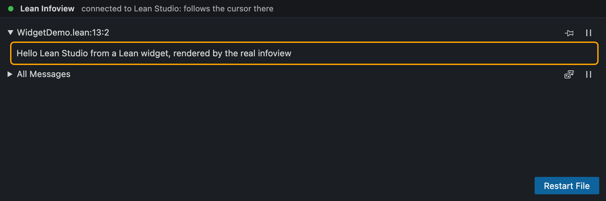

### Vim mode

*View ▸ Vim Mode* (or Preferences) makes the editor modal:
- **Modes:** normal, insert, visual and linewise visual. The current mode is in the status bar, with a block cursor in normal mode.
- **Motions:** `h j k l w b e W B E 0 ^ $ gg G f t F T ; , % { }`, with counts.
- **Operators:** `d c y > <`, with any motion or text object: `iw aw ip`, and every bracket and quote pair, including Lean's `⟨⟩`, so `ci⟨` rewrites an anonymous constructor.
- **Editing commands:** `x X D C Y s S r J ~ p P o O i a I A`.
- **Undo, repeat and search:** `u` and Ctrl-R through the editor's own undo, `.` to repeat, and `/ ? n N * #`.
- **Ex commands:** `:w :q :wq :x :N`.

⌘ and other Ctrl shortcuts stay the app's, and Unicode input (`\alpha`) works in insert mode as usual.

### Everything else a Lean IDE needs

- **Lean-aware editor**:
  - Lean 4 syntax highlighting, with `sorry` flagged.
  - Squiggles under errors and warnings.
  - An amber gutter bar while Lean elaborates.
  - Hovers with type signatures and docstrings, and for any symbol, how to type it (hover `⊢`: "Type ⊢ with \\|- or \\vdash").
  - Completion (Ctrl+Space, or after `.`).
  - Brackets, including `⟨⟩`, `⦃⦄` and `⟦⟧`, close themselves; typing the closer steps over it, and backspace removes an empty pair. The bracket matching the one at the cursor is highlighted.
  - Enter indents the next line, two spaces deeper after `:= by`, `where`, `=>` or `do`.
  - Folding for declarations, namespaces and comments.
  - Toggle comments (⌘/ / Ctrl+/), find and replace, and go to line.
- **Navigation**:
  - Go to definition (F12 or ⌘/Ctrl-click).
  - Find references (⇧F12) and rename a symbol across the project (F2).
  - An **Outline** of the file's declarations.
  - **Go to File** (⌘P / Ctrl+P), **Go to Symbol** across the project and its dependencies (⌘T / Ctrl+T), and **Find in Files** with regex (⌘⇧F / Ctrl+Shift+F).
- **Command palette** (⌘⇧P / Ctrl+Shift+P): every command, by name.
- **Unicode input**: type `\alpha`, `\to`, `\forall`, `\N`, `\<`, `\_1` and get `α → ∀ ℕ ⟨⟩ ₁`.
  - About 430 abbreviations, with a pop-up list of matches as you type.
  - An abbreviation converts as soon as it can't be extended any further. Space or Tab converts it immediately.
- **Projects**:
  - Create a Lake project from a template: library, library plus executable, executable, or Mathlib library.
  - Open any folder or file.
  - Build, clean, update dependencies, and fetch Mathlib's prebuilt cache without leaving the app.
- **Toolchains**:
  - See what elan has installed, and install `stable`, `nightly` or any version.
  - Pin a toolchain to the project, which writes `lean-toolchain` and restarts Lean on it.
  - Set elan's default.

  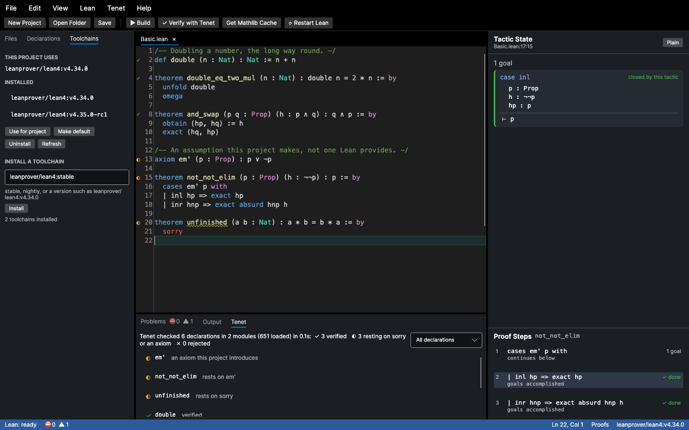
- **Problems** and **Output** panels, recent projects, and dark and light themes. Open files are restored the next time the app starts.

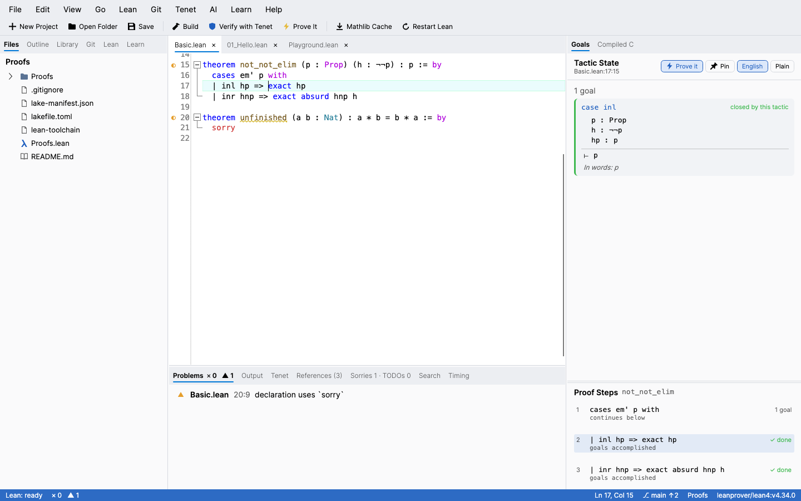

## Use it with AI assistants

Lean Studio is also an **MCP server**, so Claude Code, Gemini CLI, Codex, Grok CLI, Cursor, or any other assistant that speaks the [Model Context Protocol](https://modelcontextprotocol.io) can use Lean itself while it works, instead of guessing whether its Lean is right. The same binary does both: `LeanStudio --mcp` runs the server with no window.

**Connect one:** open **AI ▸ Connect an AI Assistant…** in Lean Studio.
- Claude Code, Gemini CLI and Codex have a one-click **Set up** button.
- Every assistant gets a snippet to copy, including ones not listed.

Or do it by hand:

```bash
claude mcp add --scope user leanstudio -- /path/to/LeanStudio --mcp
```

For Gemini CLI (`~/.gemini/settings.json`), Grok CLI, Cursor and most others, add the server to the tool's MCP configuration:

```json
{ "mcpServers": { "leanstudio": { "command": "/path/to/LeanStudio", "args": ["--mcp"] } } }
```

For Codex (`~/.codex/config.toml`):

```toml
[mcp_servers.leanstudio]
command = "/path/to/LeanStudio"
args = ["--mcp"]
```

On macOS the path is `/Applications/Lean Studio.app/Contents/MacOS/LeanStudio`. From source, the command is `dotnet` and the arguments are `["path/to/LeanStudio.dll", "--mcp"]`.

**What the assistant gets:**

| Tool | What it does |
|---|---|
| `check_file` | Elaborates a file and waits for Lean. Returns every error, warning and `#eval` result with its line and column. Can check unsaved text. |
| `goals` | The goals and hypotheses at a line and column, marking what the tactic there added or removed. |
| `proof_steps` | Every step of a tactic proof, with the state after it and what it changed. |
| `hover` | The type and documentation at a position. |
| `suggestions` | Lean's "Try this" results for `exact?`, `apply?`, `simp?` and `rw?` on a line. It can apply the one chosen and re-check the file. |
| `references` | Every use of a name across the project. |
| `run_lean` | Runs a snippet (`#eval`, `#check`, `#print axioms`) inside the project, so its imports work. |
| `build`, `verify` | `lake build`, then Tenet's independent check of every declaration: verified, rests on `sorry` or an axiom, or rejected. |
| `search_declarations`, `declaration`, `axioms` | Read the compiled library, Mathlib included. |
| `prove` | Tries a portfolio of tactics on each `sorry` in a file and reports which ones close it. It can write the first that works in place of each `sorry`. When nothing works, it looks for a counterexample. |
| `why_not_proved` | For a theorem that rests on `sorry` or an axiom, the chain of lemmas down to it, with file and line. |
| `profile` | How long each declaration takes Lean, slowest first, with the costliest step in each. |
| `search_mathlib` | Finds Mathlib results from a plain-English description (LeanSearch). |
| `export_walkthrough` | Writes a step-by-step proof walkthrough web page, and returns a Lean 4 web editor link. |
| `extract_lemma` | Turns the goal at a `sorry` into a lemma of its own, with the hypotheses it needs, and uses it there. |
| `project_map` | The project's proof state, and the sorries and axioms the most declarations depend on. |
| `ffi_bindings` | Every `@[extern]` and the C function behind it, what doesn't match, and C stubs for the missing ones. |
| `project_info`, `toolchains` | The project's layout, toolchain and build state. |
| `studio_context` | What *you* are looking at in Lean Studio: file, cursor, selection, goals, messages. |
| `studio_show` | Opens a file at a line in your Lean Studio window, so you can review what it did. |

The assistant edits files on disk the way it always does. Open files in Lean Studio reload when it changes them; files with your own unsaved edits are left alone. The server also tells the assistant how to work: check after every edit, and don't call anything proved while `sorry` remains.

This is tested with a real assistant. Claude Code, given the sample project and only these tools, proved `unfinished` by induction. It confirmed the proof with `check_file`, built the project, and got Tenet's verdict: verified.

## Install

Lean Studio needs **[elan](https://github.com/leanprover/elan#installation)**, Lean's toolchain manager. elan is the standard way to install Lean, so you may have it already. If not, Lean Studio offers to install it for you with the official installer, together with the latest stable Lean. Lean Studio has the right Lean version for each project installed through it.

Every build is self-contained, so nothing else needs installing. Pick whichever way suits you:

| | macOS | Windows | Linux |
|---|---|---|---|
| **Package manager** | [Homebrew](#homebrew-macos) | [winget](#winget-windows) | [AppImage](#appimage-linux) |
| **Download** | [`.zip` with `Lean Studio.app`](#download) | [`.zip`](#download) | [`.tar.gz`](#download) |

### Homebrew (macOS)

```bash
brew install --cask keithadler/tap/lean-studio
```

This installs `Lean Studio.app` for Apple silicon or Intel, and puts `leanstudio` on your PATH (for `leanstudio --mcp` in AI assistants' settings). `brew upgrade` keeps it current. The cask lives in [keithadler/homebrew-tap](https://github.com/keithadler/homebrew-tap), and works once the tap is published ([docs/packaging/homebrew.md](docs/packaging/homebrew.md)).

### winget (Windows)

```powershell
winget install KeithAdler.LeanStudio
```

This installs the x64 or ARM64 build and puts `leanstudio` on your PATH; `winget upgrade` keeps it current. It works once the package is accepted into the winget repository ([docs/packaging/winget.md](docs/packaging/winget.md)).

### AppImage (Linux)

One file that runs on most distributions, for x86_64 and aarch64. Download `LeanStudio-<version>-x86_64.AppImage` (or `-aarch64.AppImage`) from the [Releases](../../releases) page, then:

```bash
chmod +x LeanStudio-*.AppImage && ./LeanStudio-*.AppImage
```

It doesn't need FUSE 2 on the host. AppImages are attached to releases after 0.5.0 ([docs/packaging/appimage.md](docs/packaging/appimage.md)).

### Download

Every release on the [Releases](../../releases) page has:

| Platform | File |
|---|---|
| macOS (Apple silicon / Intel) | `LeanStudio-<version>-osx-arm64.zip` / `-osx-x64.zip` contains `Lean Studio.app` |
| Windows (x64 / ARM64) | `LeanStudio-<version>-win-x64.zip` / `-win-arm64.zip`: run `LeanStudio.exe` |
| Linux (x64 / ARM64) | `LeanStudio-<version>-linux-x64.tar.gz` / `-linux-arm64.tar.gz`: run `LeanStudio` |

Lean Studio checks GitHub for a newer release once a day and offers to download it (Help ▸ Check for Updates…; you can turn the automatic check off there).

### Unsigned builds

Until releases are code-signed ([docs/packaging/signing.md](docs/packaging/signing.md)), your system asks you to confirm the first launch:

- **macOS**: if macOS says it can't check the app, open **System Settings ▸ Privacy & Security** and click **Open Anyway** for Lean Studio. On macOS 14 and earlier, you can also right-click the app and choose **Open**.
- **Windows**: choose **More info → Run anyway** in SmartScreen.

## How it works

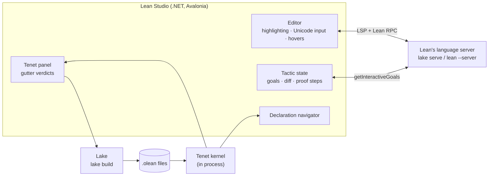
```mermaid
flowchart LR
    subgraph Studio["Lean Studio (.NET, Avalonia)"]
        Editor["Editor<br/>highlighting · Unicode input · hovers"]
        Info["Tactic state<br/>goals · diff · proof steps"]
        Nav["Declaration navigator"]
        Verify["Tenet panel<br/>gutter verdicts"]
    end
    Server["Lean's language server<br/>lake serve / lean --server"]
    Lake["Lake<br/>lake build"]
    Olean[(".olean files")]
    Tenet["Tenet kernel<br/>(in process)"]

    Editor <-- "LSP + Lean RPC" --> Server
    Info <-- "getInteractiveGoals" --> Server
    Verify --> Lake --> Olean
    Olean --> Tenet
    Tenet --> Verify
    Tenet --> Nav
```

Lean Studio divides the work so it never has to trust itself about Lean:

- **Elaboration is Lean's.** Lean Studio talks to Lean's own language server (`lake serve` in a Lake project, `lean --server` elsewhere) over LSP and Lean's RPC protocol. Goals come from `Lean.Widget.getInteractiveGoals`, which is where the before/after diff flags come from. So tactics, macros, notation and Mathlib behave exactly as they do under `lake build`.
- **Checking is Tenet's.** Tenet is an independent implementation of the Lean 4 kernel in C#, and it runs in the same process. It memory-maps the `.olean` files Lake produced and type-checks every declaration again. It also computes each declaration's axioms without relying on Lean's own `#print axioms`.

## Building from source

You need the [.NET 10 SDK](https://dotnet.microsoft.com/download) and elan. [CONTRIBUTING.md](CONTRIBUTING.md) has the full setup, and [docs/ARCHITECTURE.md](docs/ARCHITECTURE.md) explains how the code is organized.

```bash
git clone --recurse-submodules https://github.com/keithadler/leanstudio
```

Tenet is a git submodule. If you cloned without `--recurse-submodules`, run `git submodule update --init --recursive` before building.

```bash
cd leanstudio && dotnet run --project src/LeanStudio.App
```

You can pass a folder or a `.lean` file as an argument to open it on start: `dotnet run --project src/LeanStudio.App -- path/to/project`.

To build a self-contained release for one platform:

```bash
packaging/publish.sh osx-arm64
```

The runtime IDs are `osx-arm64`, `osx-x64`, `win-x64`, `win-arm64`, `linux-x64` and `linux-arm64`. The zip or tarball lands in `artifacts/`; on macOS the script also assembles `Lean Studio.app`.

### Tests

```bash
dotnet test --project tests/LeanStudio.Tests
```

The tests run against a **real Lean server** and a **real Lake build**, on the toolchain `leanprover/lean4:v4.34.0` (`elan toolchain install leanprover/lean4:v4.34.0`). They also speak MCP to the server, carry a request across the bridge, and check that the Gemini and Codex setup keeps everything else in those config files. They start `lean --server`, check the goals, hypotheses and diff flags at known positions, build `samples/Proofs`, and confirm Tenet's verdicts on it. When Lean isn't installed, the tests that need it are skipped.

```bash
dotnet run --project tools/LeanStudio.Snapshot -- . snapshots
```

This drives the **whole app** without a display, against a live Lean server. It opens a project, waits for elaboration, and reads the goals. It then plays an AI assistant: it asks the window for your context, moves your cursor, and edits the file on disk to check that the editor reloads. Finally it builds, verifies with Tenet, searches the navigator and types Unicode abbreviations. It saves a screenshot at each stage (the images in this README come from it) and fails if anything doesn't behave. CI runs it on macOS and Linux.

### Layout

| Path | What it is |
|---|---|
| `src/LeanStudio.Lsp` | JSON-RPC and LSP client for Lean's server, including Lean's goal and RPC extensions |
| `src/LeanStudio.Core` | Projects, Lake, elan, proof-step analysis, Unicode abbreviations, Tenet verification and navigation, and the workbench and bridge that AI assistants drive |
| `src/LeanStudio.Mcp` | The MCP server and its tools (`LeanStudio --mcp`) |
| `src/LeanStudio.App` | The Avalonia desktop app |
| `tests/LeanStudio.Tests` | Unit tests and integration tests against real Lean |
| `tools/LeanStudio.Snapshot` | Headless end-to-end run with screenshots |
| `external/tenet` | [Tenet](https://github.com/keithadler/tenet), as a git submodule |
| `samples/` | Small Lean projects the tests and snapshots use |
| `docs/` | The architecture guide, and the screenshots in this README |
| `packaging/` | Release scripts, the macOS bundle template, icons, the Linux desktop entry |

The build generates XML documentation for every project in `src/`, and a public type or member without a `///` comment fails it, so hovering anything in an IDE gives its documentation.

## Keyboard shortcuts

| Action | macOS | Windows / Linux |
|---|---|---|
| Build | ⌘B | Ctrl+B |
| Verify with Tenet | ⌘⇧V | Ctrl+Shift+V |
| Go to definition | F12 or ⌘-click | F12 or Ctrl-click |
| Show declaration in the Library | ⌘⇧D | Ctrl+Shift+D |
| Command palette | ⌘⇧P | Ctrl+Shift+P |
| Go to file / Go to symbol | ⌘P / ⌘T | Ctrl+P / Ctrl+T |
| Find in files | ⌘⇧F | Ctrl+Shift+F |
| Quick fix / Try this | ⌘. | Ctrl+. |
| Prove It (tactics on the sorry at the cursor) | ⌘⌥P | Ctrl+Alt+P |
| REPL at the cursor | ⌘⌥R | Ctrl+Alt+R |
| Who uses this (callers) | ⌘⌥H | Ctrl+Alt+H |
| Find references / Rename | ⇧F12 / F2 | Shift+F12 / F2 |
| Insert a snippet | Learn ▸ Insert a Snippet… | Learn ▸ Insert a Snippet… |
| Fix all in file | ⌘⌥. | Ctrl+Alt+. |
| Run a task | ⌘⇧B | Ctrl+Shift+B |
| Toggle sidebar / panel / goals | ⌘⌥B / ⌘J / ⌘⌥I | Ctrl+Alt+B / Ctrl+J / Ctrl+Alt+I |
| Zen mode / word wrap | ⌘⌥Z / ⌥Z | Ctrl+Alt+Z / Alt+Z |
| Completion | Ctrl+Space | Ctrl+Space |
| Toggle comment | ⌘/ | Ctrl+/ |
| Restart Lean | ⌘⇧R | Ctrl+Shift+R |
| Save / Save all | ⌘S / ⌘⇧S | Ctrl+S / Ctrl+Shift+S |
| Open file / New file / Close | ⌘O / ⌘N / ⌘W | Ctrl+O / Ctrl+N / Ctrl+W |
| Find / Go to line | ⌘F / ⌘L | Ctrl+F / Ctrl+G |

## Status

Lean Studio is at **0.5**, and the [changelog](CHANGELOG.md) lists what's new since then. The whole workflow works end to end and is tested against real Lean 4.34. It has been used by hand on macOS; on Windows and Linux it is built and tested by CI. Known gaps:

- ProofWidgets and other user widgets aren't rendered. Goals are Lean's interactive text, and you can hover into subterms, but there are no custom widget views.
- Tenet's badges describe the last build. After you edit a file, rebuild to refresh them.
- Release builds aren't signed or notarized.

## Documentation

| Document | What it covers |
|---|---|
| [README](README.md) (this page) | What Lean Studio does, installing it, connecting AI assistants |
| [docs/ARCHITECTURE.md](docs/ARCHITECTURE.md) | How the code is organized: the projects, how each feature talks to Lean, Lake and Tenet, settings and environment variables, and the conventions the code follows |
| [CONTRIBUTING.md](CONTRIBUTING.md) | Building, running the tests and the headless snapshot run, and what a good change looks like |
| [CHANGELOG.md](CHANGELOG.md) | What changed in each release |
| [samples/Proofs](samples/Proofs) | The small Lake project the tests, the snapshot run and the screenshots use |
| XML doc comments in `src/` | Every public type and member, documented where it is defined |

## Author

Lean Studio is created and maintained by **Keith Adler**, [@keithadler](https://x.com/keithadler) on X, who also wrote [Tenet](https://github.com/keithadler/tenet). Follow him there for updates.

## License

[MIT](LICENSE). Tenet, included as a submodule, is MIT OR Apache-2.0.
