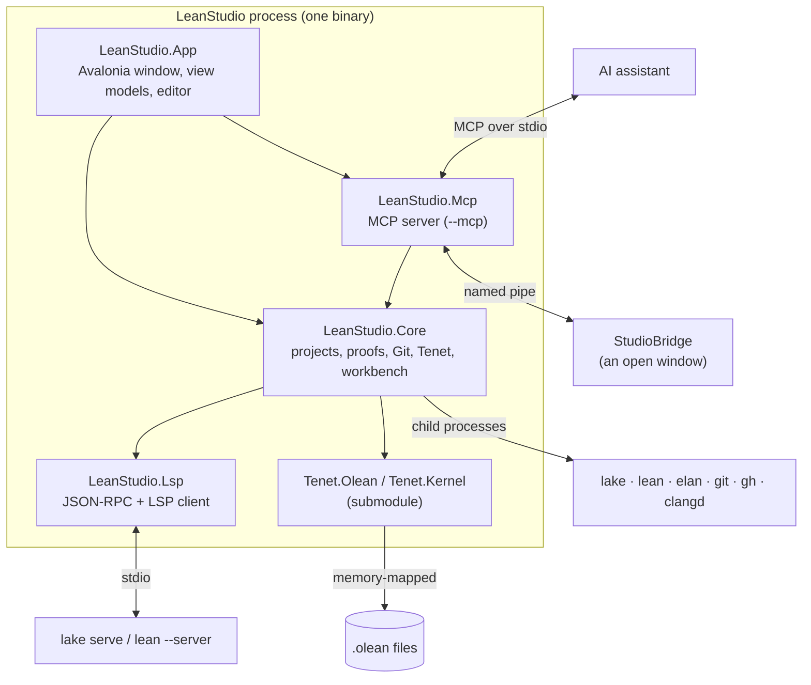

# Lean Studio architecture

This guide is for people who want to read or change Lean Studio's code. It explains how the pieces fit together,
where each feature lives, and the rules the code follows. For what the app does, see the [README](../README.md).
To set up a build and send a change, see [CONTRIBUTING](../CONTRIBUTING.md).

- [The big picture](#the-big-picture)
- [Projects and dependencies](#projects-and-dependencies)
- [LeanStudio.Lsp: talking to Lean](#leanstudiolsp-talking-to-lean)
- [LeanStudio.Core: everything that isn't UI](#leanstudiocore-everything-that-isnt-ui)
- [LeanStudio.Mcp: the MCP server](#leanstudiomcp-the-mcp-server)
- [LeanStudio.App: the desktop app](#leanstudioapp-the-desktop-app)
- [How the main features work](#how-the-main-features-work)
- [Settings, files and environment variables](#settings-files-and-environment-variables)
- [Tests and the snapshot run](#tests-and-the-snapshot-run)
- [Conventions](#conventions)

## The big picture

Lean Studio never decides for itself what Lean means. Three outside programs do the real work, and the app
coordinates them:

| Job | Who does it | How Lean Studio reaches it |
|---|---|---|
| Elaboration: goals, errors, hovers, completion | Lean's language server (`lake serve`, or `lean --server` outside a Lake project) | LSP and Lean's RPC extensions over stdio, in `LeanStudio.Lsp` |
| Building | Lake (`lake build`) | A child process, in `LeanStudio.Core.Projects.Lake` |
| Independent checking and library reads | [Tenet](https://github.com/keithadler/tenet), a separate Lean 4 kernel in C# | In process, through the `external/tenet` submodule, in `LeanStudio.Core.Verification.TenetWorkspace` |

Many features also run a scratch copy of a file through Lean (Prove It, Extract Goal as Lemma, the profiler,
Compiled C, the REPL). They add a little Lean code to the copy and read back what Lean prints. The person's file on
disk is never modified by these features.



The same executable runs in two modes, chosen in `src/LeanStudio.App/Program.cs`:

- **The window** (the default): an Avalonia desktop app.
- **The MCP server** (`LeanStudio --mcp [--project DIR]`): no window. It reads and writes JSON-RPC on stdin and
  stdout for an AI assistant, and writes its logs to stderr.

## Projects and dependencies

```
LeanStudio.Lsp   (no dependencies beyond .NET)
      ▲
LeanStudio.Core  ──► Tenet.Olean, Tenet.Kernel (external/tenet)
      ▲
LeanStudio.Mcp
      ▲
LeanStudio.App   ──► Avalonia, AvaloniaEdit (+ TextMate), CommunityToolkit.Mvvm

tests/LeanStudio.Tests      ──► Mcp (and so Core and Lsp); xUnit v3
tools/LeanStudio.Snapshot   ──► App; Avalonia.Headless
```

Everything that could run without a screen lives below `LeanStudio.App`. That split is deliberate: the MCP server,
the tests and the view models all use the same Core code, so a feature an assistant gets through MCP behaves the
same way it does in the window.

Shared build settings are in `Directory.Build.props`: .NET 10, nullable reference types, warnings as errors, and
the version number (`VersionPrefix`) that the release scripts and update checker read. The library projects and the
app also generate XML documentation, so every public type and member must have a `///` comment or the build fails.

## LeanStudio.Lsp: talking to Lean

| File | What it holds |
|---|---|
| `JsonRpcConnection.cs` | JSON-RPC 2.0 with LSP's `Content-Length` framing over a pair of streams. It answers every request the server sends (Lean waits on its own requests, such as capability registration), even when the answer is empty. |
| `LeanServer.cs` | One running Lean server and the documents open in it. It handles document sync, diagnostics, file progress, hover, definition, references, rename, completion, code actions and the goal queries. `WaitForElaborationAsync` waits until Lean has finished elaborating the current version of a document. |
| `InteractiveGoals.cs` | Lean's `getInteractiveGoals` RPC. Goals arrive as `TaggedText`, flattened into a `TaggedString`: plain text plus the span of every subterm, with its RPC reference (for hovering subterms) and its diff status (for the green/struck-through before-and-after view). |
| `CLanguageServer.cs` | clangd, for the C files of a project's FFI code. Lean's headers are passed as fallback flags, so `#include <lean/lean.h>` resolves without writing anything into the project. It reuses `LeanServer`'s hover, definition and completion parsing. |
| `Protocol.cs` | The LSP and Lean records: `Position`, `Range`, `Diagnostic`, file progress, goals, hover, completion, code actions and so on. |

Positions follow LSP everywhere: 0-based lines and UTF-16 columns. Code converts to 1-based numbers only when it
shows them to a person or an assistant.

## LeanStudio.Core: everything that isn't UI

| Folder | What it holds |
|---|---|
| `Projects/` | `LeanProject` (a Lake project, a folder pinned to a toolchain, or a bare folder; the kind decides how Lean starts and what "build" means) and `Lake` (build, clean, update, fetch Mathlib's cache, new projects from templates). |
| `Toolchains/` | `Elan`: finds elan, lists, installs and removes toolchains, and sets the default. Every Lean executable runs through elan's proxies, so a project's `lean-toolchain` file picks the version. |
| `Verification/` | `TenetWorkspace`: opens a project's `.olean` files (and everything they import) with Tenet. It re-checks declarations, computes axioms, finds why a theorem is not fully proved, builds the Project Map, and serves the declaration navigator. Files are memory-mapped and decoded lazily, so opening a Mathlib project is quick. |
| `Proofs/` | Features that ask Lean about proofs: `ProofSteps` (the tactic block around a line, read by layout), `ProofSearch` (Prove It and counterexamples), `ExtractLemma`, `Profiler` (the heat map), `Walkthrough` (the HTML export) and `LeanRepl`. |
| `Editing/` | Text-level helpers: `Abbreviations` (Unicode input), `LeanText` (comments, strings and declarations in Lean source), `Fuzzy` (picker matching) and `ProjectSearch` (find and replace across files). |
| `Workflow/` | Project-wide tools: `Markers` (sorries and TODOs), build problems, tasks, local history, module rename, Compiled C (`EmittedC`), `Ffi` (`@[extern]` bindings checked against the project's C files, and C stubs with the signature Lean expects), the elan installer and file operations. |
| `Git/` | `GitRepository` wraps your own `git` executable, so your config, hooks, credentials and signing all apply. `GitHub` goes through the `gh` CLI, so Lean Studio never handles a token. |
| `Learn/` | The tutorial, the tactic, keyword and error explanations (`Guides`), goals read aloud, and the famous theorems (`Library`). |
| `Agents/` | Support for AI assistants: `Workbench` (Lean for a program instead of a person), `StudioBridge` (the pipe between an assistant and an open window) and `AgentSetup` (writing each assistant's MCP configuration). |
| `Updates/` | `UpdateChecker`: checks GitHub Releases for a newer version. It only reports; downloads go to the Downloads folder. |
| `Processes/` | `ProcessRunner`: runs child processes, captures their output, and joins lines with `\n` on every platform. |

## LeanStudio.Mcp: the MCP server

`McpServer.cs` implements the Model Context Protocol over stdio: newline-delimited JSON-RPC 2.0, the
`initialize` and `ping` lifecycle, `tools/list` and `tools/call`. Nothing except protocol messages is written to
stdout.

`LeanTools.cs` defines every tool (`check_file`, `goals`, `prove`, `verify`, `studio_context` and the rest; the
README has the full table). Each tool is a thin wrapper around a Core call on a `Workbench`. A tool reports a
problem the assistant should read, such as bad arguments or Lean not being installed, by throwing
`ToolException`. The server returns that message as the tool's result rather than as a protocol error. Any other exception is a bug. It is logged to stderr and answered with a JSON-RPC internal error, so the assistant always gets a reply and the server keeps running.

`Workbench` keeps one `ProjectSession` per project: a Lean server started on first use, plus a Tenet workspace.
It opens files, keeps them in sync with the disk (or with text the caller passes), and waits until Lean has
finished with exactly that text. That is why `check_file` can return complete diagnostics instead of whatever
Lean had processed so far.

`studio_context` and `studio_show` reach an open Lean Studio window through `StudioBridge`. The bridge is a local
named pipe that only the current user can open, with one JSON request and one JSON response per connection. The
window serves it: `MainWindow` calls `StudioBridge.TryServe`, and `MainViewModel` answers the requests.

## LeanStudio.App: the desktop app

The app is MVVM on Avalonia, using CommunityToolkit.Mvvm's `[ObservableProperty]` and `[RelayCommand]`
source generators.

| Folder | What it holds |
|---|---|
| `ViewModels/` | `MainViewModel` is the window's state: the open project, its Lean server, the open documents and every panel. It is one partial class split by area: `MainViewModel.cs` (projects, documents, syncing with the disk, the Lean server's lifecycle, build and verify, answering the bridge), `.Features.cs` (code actions, rename, references, the outline, find in files, symbols, Git and clone), `.Workbench.cs` (auto-save, local history, sorries and TODOs, build problems, blame, tasks), `.Power.cs` (Compiled C, lightbulbs, Fix All, automatic fixes, module rename), `.Essentials.cs` (back and forward, next problem, stale imports, add import, crash recovery, installing Lean, file operations, new window), `.Learn.cs` (running programs and update checks), `.Ffi.cs` (clangd for C files, binding checks, going between an `@[extern]` and its C function, C stubs) and `.Assist.cs` (Prove It, the REPL, Extract Goal as Lemma, why not proved, the project map, the profiler, walkthroughs and share links). Each panel has its own view model: `InfoViewModel` (tactic state), `NavigatorViewModel` (Library), `VerificationViewModel` (Tenet), `SourceControlViewModel` (Git), `ToolchainsViewModel`, `LearnViewModel` and `ProofSearchViewModel`. `DocumentViewModel` is one open file. |
| `Views/` | XAML views and their code-behind. Some are built in code: `Dialogs` (prompts, confirmations, the pickers), `ProjectMapView` (the graph), `SubtermText` (goal text you can hover into). |
| `Editor/` | The AvaloniaEdit-based editor: `LeanEditor` (Unicode input, completion, hovers, brackets, go to definition), and its renderers and margins for diagnostics, inline `#eval` results, timing tints and the gutter badges. |
| `Services/` | `Settings` (persisted preferences and window state), `LeanRegistryOptions` (TextMate grammar for Lean in `Assets/lean4.tmLanguage.json`) and `Credits` (version and author). |

The view model never touches a window directly. What it needs from the UI (file pickers, prompts, confirmations,
revealing a file) goes through the `IDialogs` interface, which `MainWindow` implements. That's how the snapshot
tool drives the app headlessly.

## How the main features work

**Tactic state.** When the cursor moves, `InfoViewModel` asks `LeanServer` for the interactive goals at the cursor.
Lean's own diff flags mark hypotheses that were added or removed. `ProofSteps` finds the tactic lines of the
surrounding proof by indentation, and asks for the goals after each one. The result is cached per document
version, so moving through a proof doesn't send new queries.

**Lean's own infoview.** `InfoviewBridge` (Core) serves the vendored `@leanprover/infoview` page on 127.0.0.1, with
a secret token, and relays between it and `LeanServer` over a WebSocket: the page's `EditorApi` calls become LSP
requests or editor actions (`IInfoviewEditor`), and server notifications, document changes, cursor moves and theme
changes go back to it. The Infoview tab shows the page in `InfoviewPane`, the platform's web view
(`Avalonia.Controls.WebView`), laid over the tab's area rather than inside it so switching tabs doesn't reload
it. *View ▸ Lean Infoview in Browser* opens the same page in a browser. `InfoViewModel` asks Lean for the user
widgets at the cursor (`Lean.Widget.getWidgets`) to show the Widget button.

**Build and verify.** `Lake.BuildAsync` runs `lake build`. Then `TenetWorkspace` opens the fresh `.olean` files,
re-checks each of the project's declarations with Tenet's kernel, and gives each one a `DeclarationVerdict`:
verified, rests on `sorry` or a project axiom, or rejected.

**Prove It** (`ProofSearch`). Each `sorry` in a copy of the file becomes `leanstudio_try N`, a small tactic
defined at the top of the copy. It parses each candidate tactic at run time and runs it with a heartbeat budget.
Then it restores the state for the next candidate, so every tactic is an independent trial, all in a single pass
of Lean. A tactic the file's imports don't provide is reported as unavailable, and doesn't break the parse. When
nothing closes a goal, the copy is searched for small `Nat`, `Int` and `Bool` counterexamples (and Plausible runs
where the project has it).

**Why isn't this proved?** `TenetWorkspace` searches the dependency graph breadth-first, from the theorem to the
nearest `sorry` or project axiom, and returns the shortest chain as an `AssumptionTrail`.

**Profiler.** A copy of the file runs with `set_option trace.profiler true`. The trace is parsed into a time per
declaration, with the step inside it that took longest.

**Extract Goal as Lemma.** In a scratch copy, the `sorry` becomes a tactic that asks Lean which hypotheses the goal
depends on, and has Lean print the lemma's signature. The edit to the real file is applied as a single undoable
change.

**REPL.** One scratch document stays open in Lean. It holds the file's text up to the cursor's declaration, and
each input replaces only its last lines, so Lean reuses the elaboration it has already done.

**AI assistants and the window.** When a window opens, it starts serving `StudioBridge` (if another window already
owns the pipe, it steps aside). An assistant's `studio_context` call asks the window what file, cursor, selection
and goals the person has. When an assistant edits a file on disk, the file watcher reloads any open document that
has no unsaved edits of your own.

## Settings, files and environment variables

| What | Where |
|---|---|
| Settings (`settings.json`) | `LeanStudio` in .NET's `ApplicationData` folder: `%APPDATA%\LeanStudio` on Windows, `~/.config/LeanStudio` on macOS and Linux |
| Tutorial and playground | `Lean Studio` in the system's Documents folder |
| elan | `$ELAN_HOME`, or `~/.elan` |

Environment variables, mostly for tests and for running two setups side by side:

| Variable | Effect |
|---|---|
| `LEANSTUDIO_SETTINGS_DIR` | Use this folder for settings instead of the default. |
| `LEANSTUDIO_HOME` | Put the tutorial and playground here instead of `Documents/Lean Studio`. |
| `LEANSTUDIO_PIPE` | Use this name for the bridge pipe, so a test run doesn't talk to the window you have open. |
| `ELAN_HOME` | Where elan is installed, as elan itself uses it. |

## Tests and the snapshot run

`tests/LeanStudio.Tests` uses xUnit v3 on Microsoft.Testing.Platform. Most tests run against a real Lean
(toolchain `leanprover/lean4:v4.34.0`, pinned in `tests/LeanStudio.Tests/Lean.cs` and in CI). Tests that need Lean
call `Lean.RequireLean()`, and are skipped when elan isn't installed. Tests that start a Lean server join the
`Lean` collection, so they run one at a time.

`tools/LeanStudio.Snapshot` starts the real app on Avalonia's headless platform, against a real Lean server and
the `samples/Proofs` project. It walks through the main features, asserts what each one shows, and saves a
screenshot after each step. The README's images come from it. It sets `LEANSTUDIO_SETTINGS_DIR`, `LEANSTUDIO_HOME`
and `LEANSTUDIO_PIPE` so it never touches your real settings or an open window.

CI (`.github/workflows/ci.yml`) builds and tests on Linux, macOS and Windows, and runs the snapshot on Linux and
macOS. A `v*` tag also packages all six platforms and attaches them to a GitHub release.

## Conventions

- **Lean is the authority.** Don't reimplement what Lean can answer. Ask the server, or run a scratch copy of the
  file and read what Lean prints.
- **Never modify the person's file behind their back.** Analysis runs on copies. Edits the person asks for are
  applied through the editor as one undoable change. Other files get a local history entry first.
- **Use the person's own tools.** Git and GitHub go through `git` and `gh`. Lean goes through elan.
- **0-based inside, 1-based outside.** Lines and columns are 0-based in code, as in LSP. They're 1-based wherever a
  person or an assistant reads them.
- **Documented public surface.** Every public type and member has a `///` comment that says what it does and
  anything a caller needs to know. The build enforces this.
- **Plain words.** Comments, UI text and docs use short, plain sentences, and code identifiers go in
  `<c>…</c>` or backticks.
