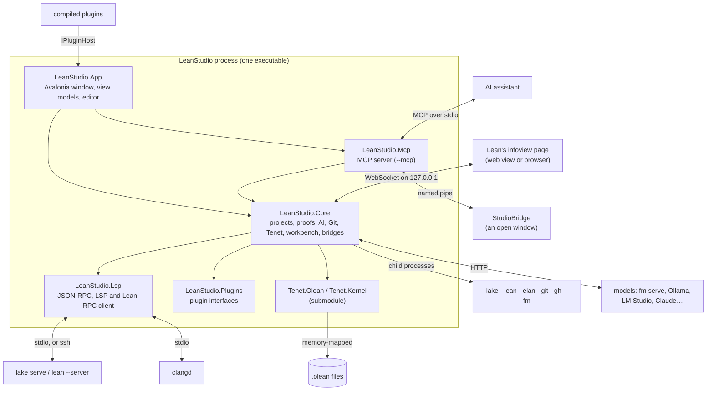
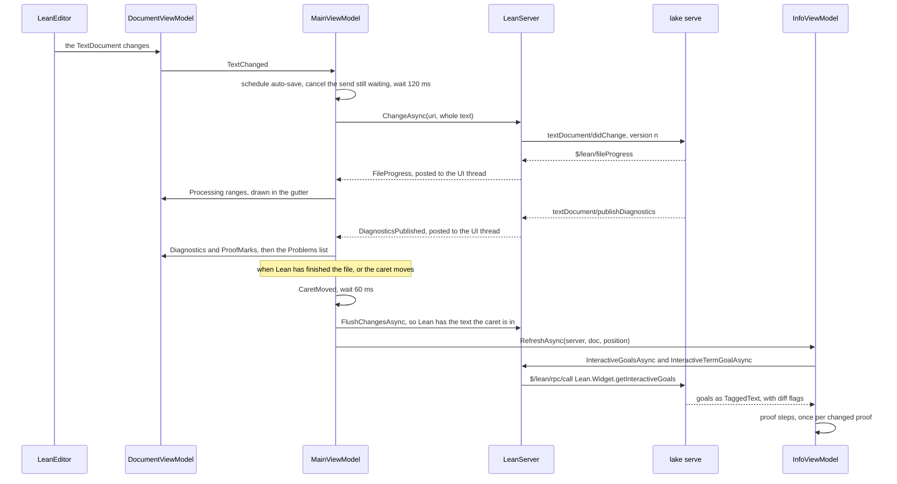
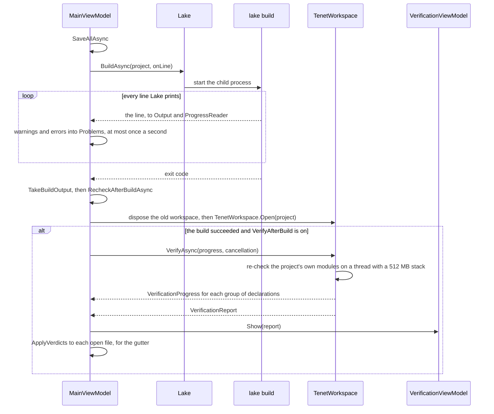
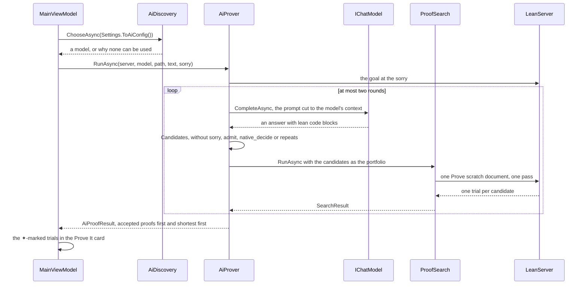

# Lean Studio architecture

This guide is for people who want to read or change Lean Studio's code. It explains how the pieces fit together,
where each feature lives, and the rules the code follows. For what the app does, see the [README](../README.md).
To set up a build and send a change, see [CONTRIBUTING](../CONTRIBUTING.md).

- [The big picture](#the-big-picture)
- [Projects and dependencies](#projects-and-dependencies)
- [LeanStudio.Lsp: talking to Lean](#leanstudiolsp-talking-to-lean)
- [LeanStudio.Core: everything that isn't UI](#leanstudiocore-everything-that-isnt-ui)
- [LeanStudio.Plugins: the plugin API](#leanstudioplugins-the-plugin-api)
- [LeanStudio.Mcp: the MCP server](#leanstudiomcp-the-mcp-server)
- [LeanStudio.App: the desktop app](#leanstudioapp-the-desktop-app)
- [Channels to other processes](#channels-to-other-processes)
- [From a keystroke to goals and diagnostics](#from-a-keystroke-to-goals-and-diagnostics)
- [Build, then verify with Tenet](#build-then-verify-with-tenet)
- [How the main features work](#how-the-main-features-work)
- [Settings, files and environment variables](#settings-files-and-environment-variables)
- [Tests, the headless run and CI](#tests-the-headless-run-and-ci)
- [Where to start for common changes](#where-to-start-for-common-changes)
- [Conventions](#conventions)

## The big picture

Lean Studio never decides for itself what Lean means. Outside programs do the real work, and the app coordinates
them:

| Job | Who does it | How Lean Studio reaches it |
|---|---|---|
| Elaboration: goals, errors, hovers, completion | Lean's language server (`lake serve`, or `lean --server` outside a Lake project) | LSP and Lean's RPC extensions over stdio (over SSH for a remote project), in `LeanStudio.Lsp` |
| Building | Lake (`lake build`) | A child process, in [`Lake`](../src/LeanStudio.Core/Projects/Lake.cs) |
| Independent checking and library reads | [Tenet](https://github.com/keithadler/tenet), a separate Lean 4 kernel in C# | In process, through the `external/tenet` submodule, in [`TenetWorkspace`](../src/LeanStudio.Core/Verification/TenetWorkspace.cs) |
| Suggesting proofs and answering questions | A language model: Apple's on-device model, a local server (Ollama, LM Studio, llama.cpp, MLX), or a cloud model the person chose | The `fm` command or HTTP, in [`Core/Ai`](../src/LeanStudio.Core/Ai) |

A model only suggests. Every proof it proposes is run by Lean before it is shown, the same way Prove It runs its
own tactics.

Many features run a scratch copy of a file through Lean (Prove It, AI proofs, Extract Goal as Lemma, the profiler,
heartbeats, Compiled C, the REPL, unused imports). They add a little Lean code to the copy and read back what Lean
prints. The person's file on disk is never modified by these features.


```mermaid
flowchart TB
    subgraph Process["LeanStudio process (one executable)"]
        App["LeanStudio.App<br/>Avalonia window, view models, editor"]
        Mcp["LeanStudio.Mcp<br/>MCP server (--mcp)"]
        Core["LeanStudio.Core<br/>projects, proofs, AI, Git, Tenet, workbench, bridges"]
        Lsp["LeanStudio.Lsp<br/>JSON-RPC, LSP and Lean RPC client"]
        Api["LeanStudio.Plugins<br/>plugin interfaces"]
        Tenet["Tenet.Olean / Tenet.Kernel<br/>(submodule)"]
        App --> Mcp
        App --> Core
        Mcp --> Core
        Core --> Lsp
        Core --> Api
        Core --> Tenet
    end
    Lsp <-->|stdio, or ssh| Server["lake serve / lean --server"]
    Lsp <-->|stdio| Clangd["clangd"]
    Core -->|child processes| Tools["lake · lean · elan · git · gh · fm"]
    Core <-->|HTTP| Models["models: fm serve, Ollama,<br/>LM Studio, Claude…"]
    Tenet -->|memory-mapped| Olean[(".olean files")]
    Assistant["AI assistant"] <-->|MCP over stdio| Mcp
    Mcp <-->|named pipe| Window["StudioBridge<br/>(an open window)"]
    Page["Lean's infoview page<br/>(web view or browser)"] <-->|WebSocket on 127.0.0.1| Core
    Plugins["compiled plugins"] -->|IPluginHost| App
```

The same executable runs in several modes, chosen in [`Program.cs`](../src/LeanStudio.App/Program.cs):

- **The window** (the default): an Avalonia desktop app. `LeanStudio PATH` opens a folder or a `.lean` file, and
  `--new-window` opens a new window instead of restoring the last session.
- **The MCP server** (`LeanStudio --mcp [--project DIR]`): no window. It reads and writes JSON-RPC on stdin and
  stdout for an AI assistant, and writes its logs to stderr.
- `--help` and `--version` print and exit, before any window is created.

## Projects and dependencies

```
LeanStudio.Plugins   (no dependencies beyond .NET)
LeanStudio.Lsp       (no dependencies beyond .NET)
      ▲
LeanStudio.Core  ──► LeanStudio.Plugins, Markdig (Markdown), Tenet.Olean ──► Tenet.Kernel (external/tenet)
      ▲
LeanStudio.Mcp
      ▲
LeanStudio.App   ──► Avalonia, Avalonia.Controls.WebView, AvaloniaEdit (+ TextMate), CommunityToolkit.Mvvm,
                     Porta.Pty (pseudo-terminals), XTerm.NET (the terminal emulator)

tests/LeanStudio.Tests         ──► Mcp (and so Core, Lsp and Plugins); xUnit v3; builds samples/Plugins/HelloLean
tools/LeanStudio.Snapshot      ──► App; Avalonia.Headless, Avalonia.Skia
samples/Plugins/HelloLean      ──► LeanStudio.Plugins only
```

Everything that could run without a screen lives below `LeanStudio.App`. That split is deliberate: the MCP server,
the tests and the view models all use the same Core code, so a feature an assistant gets through MCP behaves the
same way it does in the window. [`LeanStudio.slnx`](../LeanStudio.slnx) lists every project, the sample plugin and
Tenet's two projects included.

Shared build settings are in [`Directory.Build.props`](../Directory.Build.props): .NET 10, nullable reference
types, warnings as errors, the Avalonia and AvaloniaEdit versions, and the version number (`VersionPrefix`).
`packaging/publish.sh` reads the version from there, and the assemblies carry it, which is where the update checker
and the About box get it. [`src/Directory.Build.props`](../src/Directory.Build.props) adds XML documentation for
every project in `src/`: a public type or member without a `///` comment is warning CS1591, and so fails the
build. [`global.json`](../global.json) pins the .NET SDK (10.0.100, rolling forward to newer feature bands) and selects Microsoft.Testing.Platform for `dotnet test`.

## LeanStudio.Lsp: talking to Lean

| File | What it holds |
|---|---|
| [`JsonRpcConnection.cs`](../src/LeanStudio.Lsp/JsonRpcConnection.cs) | JSON-RPC 2.0 with LSP's `Content-Length` framing over a pair of streams. It answers every request the server sends (Lean waits on its own requests, such as capability registration), even when the answer is empty. A message it can't handle (malformed, or a handler threw) is skipped and reported through `DispatchFailed`, so one bad message never stops the reading. `Outgoing` and `Incoming` can rewrite each message's text, which is how a remote project's paths are translated. |
| [`LeanServer.cs`](../src/LeanStudio.Lsp/LeanServer.cs) | One running Lean server and the documents open in it: document sync (the whole text on every change), diagnostics, file progress, hover, definition, references, rename, completion, code actions, folding, and the goal queries. Lean's silent "Goals accomplished!" diagnostics are kept apart (`SilentDiagnosticsOf`) for the proof-end marks. RPC sessions are opened per file and kept alive every 10 seconds. `WaitForElaborationAsync` waits until Lean has finished elaborating the current version of a document. `MessageLogPath` logs every message, for troubleshooting. |
| [`EditorFeatures.cs`](../src/LeanStudio.Lsp/EditorFeatures.cs) | More of `LeanServer` (a partial class): semantic tokens, inlay hints, document highlights, the call hierarchy, user widgets (`Lean.Widget.getWidgets`), interactive diagnostics and trace trees fetched level by level. |
| [`InteractiveGoals.cs`](../src/LeanStudio.Lsp/InteractiveGoals.cs) | Lean's `getInteractiveGoals` RPC. Goals arrive as `TaggedText`, flattened into a `TaggedString`: plain text plus the span of every subterm, with its RPC reference (for hovering subterms) and its diff status (for the green and struck-through before-and-after view). `GoalFilter` is the Tactic State's ⋯ menu (hide types, instances, inaccessible names, let values). |
| [`CLanguageServer.cs`](../src/LeanStudio.Lsp/CLanguageServer.cs) | clangd, for the C files of a project's FFI code. Lean's headers are passed as fallback flags, so `#include <lean/lean.h>` resolves without writing anything into the project. It reuses `LeanServer`'s hover, definition and completion parsing. |
| [`Remote.cs`](../src/LeanStudio.Lsp/Remote.cs) | `RemoteTarget`: a project whose Lean runs elsewhere, on another machine over `ssh` (through a local mount), in a container, or in WSL. Paths are rewritten both ways, so everything in the editor names local files. `RemoteTargets` is the registry that `LeanServer` and `ProcessRunner` look a working folder up in. |
| [`Protocol.cs`](../src/LeanStudio.Lsp/Protocol.cs) | The LSP and Lean records: `Position`, `Range`, `Diagnostic`, `ProofMark`, file progress, goals, hover, completion, code actions and so on. |

Positions follow LSP everywhere: 0-based lines and UTF-16 columns. Code converts to 1-based numbers only when it
shows them to a person or an assistant.

## LeanStudio.Core: everything that isn't UI

| Folder | What it holds |
|---|---|
| [`Projects/`](../src/LeanStudio.Core/Projects) | `LeanProject` (a Lake project, a folder pinned to a toolchain, or a bare folder; the kind decides how Lean starts and what "build" means), `Lake` (build, clean, update, fetch Mathlib's cache, new projects from templates), `ImportGraph` (Imports and Imported By) and `LibraryRoot` (the root file that imports every module, like `lake exe mk_all`). |
| [`Toolchains/`](../src/LeanStudio.Core/Toolchains) | `Elan`: finds elan, lists, installs and removes toolchains, and sets the default. Every Lean executable runs through elan's proxies, so a project's `lean-toolchain` file picks the version. `LeanProcesses` lists Lean's file workers with their memory. `LeanReleases` decides whether a newer stable Lean is worth offering (only to a project with no dependencies, pinned to a plain release). |
| [`Verification/`](../src/LeanStudio.Core/Verification) | `TenetWorkspace`: opens a project's `.olean` files (and everything they import) with Tenet. It re-checks declarations, computes axioms, finds why a theorem is not fully proved, builds the Project Map, checks blueprint nodes, and serves the declaration navigator. See [Tenet's workspace](#how-the-main-features-work) below. |
| [`Proofs/`](../src/LeanStudio.Core/Proofs) | Features that ask Lean about proofs: `ProofSteps` (the tactic block around a line, read by layout), `ProofSearch` (Prove It and counterexamples) and `Scratch` (scratch documents in the running server), `ExtractLemma`, `Profiler` (Lean's profilers read into a `ProfileReport`: trees, categories, counters, per-line costs; its records are in `ProfileModel`), `LiveProfiler` (the same, from the running server as the file is edited), `ProfileCheck` (saved profiles in `ProfileStore`, and the heartbeat regression check), `Heartbeats`, `ProofStates` (the Proof-State Map), `Walkthrough` (the HTML export) and `LeanRepl`. |
| [`Ai/`](../src/LeanStudio.Core/Ai) | The AI in the editor: `IChatModel` and the clients behind it (`AppleIntelligence` and `AppleFmCliModel` for the `fm` command, `OllamaModel`, `OpenAiCompatibleModel`, `AnthropicModel`), `AiDiscovery` (what is running, and which model to use), `AiProver` (proofs from a model, checked by Lean), `AiAssistant` (explanations and chat), `AiText` (token estimates and trimming) and `SecretStore` (API keys). |
| [`Editing/`](../src/LeanStudio.Core/Editing) | Text-level engines with no UI: `Abbreviations` (Unicode input), `LeanText` (comments, strings and declarations in Lean source), `LatexText` (docstring math as text), `Fuzzy` (picker matching), `ProjectSearch` (find and replace across files), `MultiCursor`, `VimEngine`, `EmacsEngine` and `KeyBindingsFile` (keybindings.json). The editor in the app is a thin host over them. |
| [`Workflow/`](../src/LeanStudio.Core/Workflow) | Project-wide tools. `Workflow.cs` holds `Markers` (sorries and TODOs), `LakeOutput` (build problems), `LocalHistory`, `Loogle`, `LeanSearch`, `DocLinks`, `Blame` and `ProjectTasks`. Beside it: `Refactor` and `EmittedC` (module rename, replace across files, Compiled C), `Ffi` (`@[extern]` bindings checked against the project's C files, and C stubs), `ImportCheck` (unused imports), `ImportOrder` (sorted imports), `StyleCheck` (Mathlib's text rules), `MathlibConventions` (header, module docstring, theorem names), `DocCoverage` (definitions with no doc comment), `StaleDeprecations` (old deprecated aliases, found and deleted), `Lint`, `Instances`, `Deprecation` (deprecated aliases for renames), `DependencyBump` (Update Mathlib and see what broke), `Blueprint`, `ProjectCommands` (`.leanstudio/commands.json`), `ProgressReader` (progress read from what a task prints), `LeanCli` (the `lean` command line on a mirror copy) and `Essentials.cs` (`ElanInstaller`, `FileOps`, `ImportFinder`). |
| [`Git/`](../src/LeanStudio.Core/Git) | `GitRepository` wraps your own `git` executable, so your config, hooks, credentials and signing all apply. `GitHub` goes through the `gh` CLI, so Lean Studio never handles a token. |
| [`Learn/`](../src/LeanStudio.Core/Learn) | `Tutorial` and `Playground`; `TacticGuide`, `ErrorGuide` and `PlainEnglish` (goals read aloud) in `Guides.cs`; `Snippets`, `TheoremGallery` and `ProgramRunner` in `Library.cs`. |
| [`Agents/`](../src/LeanStudio.Core/Agents) | For assistants and web pages: `Workbench` and `ProjectSession` (Lean for a program instead of a person, used by the MCP server), `StudioBridge` (the pipe between an assistant and an open window), `InfoviewBridge` (Lean's own infoview page, served to a web view or browser) and `AgentSetup` (writing each assistant's MCP configuration). |
| [`Plugins/`](../src/LeanStudio.Core/Plugins) | `PluginLoader`: finds plugin assemblies and loads each in a load context of its own. |
| [`Updates/`](../src/LeanStudio.Core/Updates) | `UpdateChecker`: checks GitHub Releases for a newer version. It only reports; downloads go to the Downloads folder. |
| [`Platform/`](../src/LeanStudio.Core/Platform) | `MacPlatform`: whether this is the Intel build running under Rosetta on Apple silicon. |
| [`Processes/`](../src/LeanStudio.Core/Processes) | `ProcessRunner`: runs child processes (over SSH for Lean's tools in a remote project), captures their output, stops their children when cancelled, and joins lines with `\n` on every platform. |

## LeanStudio.Plugins: the plugin API

[`Plugin.cs`](../src/LeanStudio.Plugins/Plugin.cs) is the whole contract a compiled plugin sees, and nothing else
from Lean Studio is visible to it:

- `ILeanStudioPlugin`: a public class with a parameterless constructor, a `Name`, and `Initialize(IPluginHost)`.
- `IPluginHost`: the app as a plugin sees it. `AddCommand` puts a command in the palette (so it can be bound to a
  key), `ActiveDocument` reads and edits the file in the editor as one undoable change, `MessagesOf` returns
  Lean's messages, `RunAsync` runs a program in the project, `CheckLeanAsync` checks Lean code with the project's
  dependencies (`lake env lean`), and `FileOpened` and `FileSaved` report what the person does.
- `IPluginDocument`, `PluginMessage` and `PluginProcessResult`: what those calls take and return.

At start, [`PluginLoader`](../src/LeanStudio.Core/Plugins/PluginLoader.cs) loads `plugins/Name.dll` or
`plugins/Name/Name.dll` from the settings folder. Each gets an `AssemblyLoadContext` that resolves its own
dependencies from its folder but shares `LeanStudio.Plugins` with the app, so the interfaces are the same types on
both sides. A plugin that fails to load or to initialize is left out with a line in Output; the others still load.
[`PluginHost`](../src/LeanStudio.App/Services/PluginHost.cs) in the app implements `IPluginHost` over
`MainViewModel`. Plugins run on the UI thread with the app's permissions. The complete example is
[`samples/Plugins/HelloLean`](../samples/Plugins/HelloLean), and
[`PluginTests`](../tests/LeanStudio.Tests/PluginTests.cs) builds and loads it.

## LeanStudio.Mcp: the MCP server

[`McpServer.cs`](../src/LeanStudio.Mcp/McpServer.cs) implements the Model Context Protocol over stdio:
newline-delimited JSON-RPC 2.0, the `initialize` and `ping` lifecycle, `tools/list` and `tools/call`. It speaks
protocol versions 2025-06-18, 2025-03-26 and 2024-11-05. Requests run concurrently, so a long build doesn't block a
quick question, and responses are written one line at a time under a lock. Nothing except protocol messages is
written to stdout.

[`LeanTools.cs`](../src/LeanStudio.Mcp/LeanTools.cs) defines the 29 tools, in the order clients list them:

| Area | Tools |
|---|---|
| Checking and reading a file | `project_info`, `check_file`, `goals`, `proof_steps`, `hover`, `suggestions`, `references`, `run_lean` |
| Building and Tenet | `build`, `verify`, `axioms`, `why_not_proved`, `project_map` |
| Proof tools | `prove`, `extract_lemma`, `ffi_bindings`, `profile` |
| For Mathlib contributors | `unused_imports`, `sort_imports`, `style_check`, `stale_deprecations`, `lint`, `heartbeats`, `instances`, `blueprint` |
| Walkthroughs and search | `export_walkthrough`, `search_mathlib`, and `declaration` and `search_declarations` (the compiled library, through Tenet) |
| Toolchains | `toolchains` |
| The open window | `studio_context`, `studio_show` |

Each tool is a thin wrapper around a Core call on a `Workbench`. Tools take 1-based lines and columns and answer in
text written for a model to read. A tool reports a problem the assistant should read, such as bad arguments or
Lean not being installed, by throwing `ToolException`. The server returns that message as the tool's result with
`isError` set, rather than as a protocol error. Any other exception is a bug: it is logged to stderr and answered
with a JSON-RPC internal error, so the assistant always gets a reply and the server keeps running.

`LeanTools.Instructions` is sent in the `initialize` result and tells the model how to work (check after every
edit, and nothing is proved while `sorry` remains).

[`Workbench`](../src/LeanStudio.Core/Agents/Workbench.cs) keeps one `ProjectSession` per project: a Lean server
started on first use, plus a Tenet workspace that is reopened after a `build`. It opens files, keeps them in sync
with the disk (or with text the caller passes), and waits until Lean has finished with exactly that text, for up to
`ProjectSession.ElaborationTimeout` (10 minutes). That is why `check_file` can return complete diagnostics instead
of whatever Lean had processed so far. Checks of one file take turns, so assistants calling in parallel never read
each other's messages; `run_lean` snippets take turns on their scratch file under `.lake/leanstudio` the same way.

`studio_context` and `studio_show` reach an open Lean Studio window through `StudioBridge`: see
[Channels to other processes](#channels-to-other-processes).

## LeanStudio.App: the desktop app

The app is MVVM on Avalonia, using CommunityToolkit.Mvvm's `[ObservableProperty]` and `[RelayCommand]` source
generators.

| Folder | What it holds |
|---|---|
| [`ViewModels/`](../src/LeanStudio.App/ViewModels) | `MainViewModel` is the window's state: the open project, its Lean server, the open documents and every panel. It is one partial class split by area, listed below. Each panel has its own view model: `InfoViewModel` (Tactic State, with `ProofSearchViewModel` for the Prove It card), `NavigatorViewModel` (Library), `VerificationViewModel` (Tenet), `SourceControlViewModel` (Git), `ToolchainsViewModel` and `LearnViewModel`. `DocumentViewModel` is one open file; `FileNode` is one entry in the file tree. |
| [`Views/`](../src/LeanStudio.App/Views) | XAML views and their code-behind: `MainWindow`, `WelcomeView`, `InfoView`, `NavigatorView`, `VerificationView`, `SourceControlView`, `ToolchainsView`, `LearnView`, `BuildDashboard` and `ProfilerView`. Some are built in code: `DiffWindow` (side-by-side diffs, from Core's `TextDiff`), `MarkdownView` (the preview, from Core's `MarkdownModel`), `TerminalView` (the terminal's screen), `Dialogs` (prompts, confirmations, Preferences), `Picker` (Go to File, the command palette and the other pickers), `ProjectMapView` and `ProjectMapWindow`, `FlameGraph` (the profiler's trace, drawn), `ProofStatesWindow`, `AiChatWindow` and `AiDialogs`, `InfoviewPane` (the platform's web view) and `SubtermText` (goal text you can hover into). |
| [`Editor/`](../src/LeanStudio.App/Editor) | The AvaloniaEdit-based editor: `LeanEditor` (Unicode input, completion, hovers, brackets, go to definition), `EditorVimHost` (the host for Core's Vim and Emacs engines), `MultiCursorLayer`, `SemanticColorizer`, `OccurrenceHighlighter` and `InlayHintGenerator` (what Lean knows about the text), the renderers and margins for diagnostics, inline `#eval` results, timing tints, proof-end marks and the gutter badges (`StatusMargin`), and around the text: `StickyScroll` and `Breadcrumbs` (in `EditorChrome.cs`, from Core's `LeanScopes`), `Minimap`, `ConflictLayer` (merge conflicts, from Core's `MergeConflicts`), `GhostText` (AI completion as you type) and `EditorScroll` (scrolling to a pixel offset, which AvaloniaEdit's own method does not do). |
| [`Services/`](../src/LeanStudio.App/Services) | `Settings` (persisted preferences and window state), `PluginHost`, `InfoviewAssets` (the vendored infoview page, embedded from `Infoview/`), `LeanRegistryOptions` (TextMate grammar for Lean in `Assets/lean4.tmLanguage.json`), `TaskbarProgress` (progress on the Dock icon and the Windows taskbar), `TerminalSession` (a shell on a pseudo-terminal, fed to xterm's emulator), `MacQuitEvent` (answering macOS's quit Apple Event) and `Credits` (version and author). |

`MainViewModel`'s parts:

| File | Area |
|---|---|
| [`MainViewModel.cs`](../src/LeanStudio.App/ViewModels/MainViewModel.cs) | Projects, documents, syncing edits with Lean and with the disk, the Lean server's lifecycle, build and verify, answering the bridge |
| [`.Features.cs`](../src/LeanStudio.App/ViewModels/MainViewModel.Features.cs) | Code actions, rename, references, the outline, find in files, symbols, Git and clone |
| [`.Workbench.cs`](../src/LeanStudio.App/ViewModels/MainViewModel.Workbench.cs) | Auto-save, local history, sorries and TODOs, build problems, blame, tasks |
| [`.Power.cs`](../src/LeanStudio.App/ViewModels/MainViewModel.Power.cs) | Compiled C, lightbulbs, Fix All, automatic fixes, module rename |
| [`.Essentials.cs`](../src/LeanStudio.App/ViewModels/MainViewModel.Essentials.cs) | Back and forward, next problem, stale imports, add import, crash recovery, installing Lean, file operations, new window |
| [`.Learn.cs`](../src/LeanStudio.App/ViewModels/MainViewModel.Learn.cs) | The Learn tab, running programs, snippets, update checks |
| [`.Ffi.cs`](../src/LeanStudio.App/ViewModels/MainViewModel.Ffi.cs) | clangd for C files, binding checks, going between an `@[extern]` and its C function, C stubs |
| [`.Assist.cs`](../src/LeanStudio.App/ViewModels/MainViewModel.Assist.cs) | Prove It, the REPL, Extract Goal as Lemma, why not proved, the project map, walkthroughs and share links |
| [`.Profiler.cs`](../src/LeanStudio.App/ViewModels/MainViewModel.Profiler.cs) | The Profiler panel: profiles of a file, a declaration or the project, the details of each, the baseline, exports |
| [`.Ai.cs`](../src/LeanStudio.App/ViewModels/MainViewModel.Ai.cs) | Choosing a model, Ask AI to Prove This Sorry, Explain This, Ask AI, and asking the AI when Prove It is stuck |
| [`.ProofStates.cs`](../src/LeanStudio.App/ViewModels/MainViewModel.ProofStates.cs) | Collecting the Proof-State Map for a file or the whole project |
| [`.Pro.cs`](../src/LeanStudio.App/ViewModels/MainViewModel.Pro.cs) | Unused imports, Lint File, deprecated aliases, the library root, heartbeats, instances, imports graph, Update Mathlib, blueprint, project commands, Tactic State copy and comment |
| [`.Progress.cs`](../src/LeanStudio.App/ViewModels/MainViewModel.Progress.cs) | The progress bar, the banner, the dashboard's lines and the note when a long task ends |
| [`.BuildView.cs`](../src/LeanStudio.App/ViewModels/MainViewModel.BuildView.cs) | Modules compiling now, marks in the file tree, module timings, re-checking files after a build |
| [`.Infoview.cs`](../src/LeanStudio.App/ViewModels/MainViewModel.Infoview.cs) | Lean's own infoview in the tab or the browser |
| [`.Split.cs`](../src/LeanStudio.App/ViewModels/MainViewModel.Split.cs) | The split editor |
| [`.Remote.cs`](../src/LeanStudio.App/ViewModels/MainViewModel.Remote.cs) | Projects on another machine, in a dev container or in WSL |
| [`.Terminal.cs`](../src/LeanStudio.App/ViewModels/MainViewModel.Terminal.cs) | The integrated terminal |
| [`.Diff.cs`](../src/LeanStudio.App/ViewModels/MainViewModel.Diff.cs) | Side-by-side diffs |
| [`.Markdown.cs`](../src/LeanStudio.App/ViewModels/MainViewModel.Markdown.cs) | The Markdown preview |

The view model never touches a window directly. What it needs from the UI (file pickers, prompts, confirmations,
revealing a file) goes through the `IDialogs` interface, which `MainWindow` implements, and it raises events (such
as `ProofStatesReady`) for windows it wants shown. `MainWindow` owns the menus, the key handling, the command palette
(`Commands()` in [`MainWindow.axaml.cs`](../src/LeanStudio.App/Views/MainWindow.axaml.cs)) and the person's own
shortcuts from keybindings.json. `DialogHooks.Opened` lets the headless run see each dialog as it opens.

## Channels to other processes

| Channel | Between | Where | Details |
|---|---|---|---|
| LSP over stdio | The app or the workbench, and Lean's server | [`LeanServer`](../src/LeanStudio.Lsp/LeanServer.cs) | One server per project. For a remote project the command runs through `ssh` and every message's paths are rewritten. |
| LSP over stdio | The app and clangd | [`CLanguageServer`](../src/LeanStudio.Lsp/CLanguageServer.cs) | Started once a C file is opened, if clangd is installed. |
| Child processes | Core and `lake`, `lean`, `elan`, `git`, `gh`, `fm`, `ssh`, and `security` or `secret-tool` for keys | [`ProcessRunner`](../src/LeanStudio.Core/Processes/ProcessRunner.cs) | Output captured line by line; cancelling stops the process and its children. Processes that stay running (`fm serve`, `fm respond` streaming an answer) are started by `AppleIntelligence` and `AppleFmCliModel` themselves. |
| Named pipe | An MCP server process and an open window | [`StudioBridge`](../src/LeanStudio.Core/Agents/StudioBridge.cs) | Named `leanstudio-` and the user name (or `$LEANSTUDIO_PIPE`), and only the current user can open it. One JSON object per line each way, one request per connection, a 5 second timeout. The methods are `context` and `show`. The first window claims the name and keeps it: it holds at most two pipe instances, so the name is never free between requests. On macOS and Linux the pipe is a socket file, and one left by a crashed window is removed when nothing is listening on it. `MainWindow` answers on the UI thread through `MainViewModel.BridgeContext` and `BridgeShowAsync`. |
| HTTP and WebSocket on 127.0.0.1 | The app and Lean's infoview page | [`InfoviewBridge`](../src/LeanStudio.Core/Agents/InfoviewBridge.cs) | Serves the vendored `@leanprover/infoview` page with a secret token in its address, and relays between its `EditorApi` and `LeanServer`. Editor actions go through `IInfoviewEditor`. |
| HTTP | Core and models | [`HttpChatModels.cs`](../src/LeanStudio.Core/Ai/HttpChatModels.cs) | Streaming chat completions; OpenAI-compatible servers, Ollama's own API, and Anthropic's API. |
| HTTPS | Core and web services | `UpdateChecker`, `LeanReleases`, `Loogle`, `LeanSearch` | GitHub's release API for Lean Studio and for Lean; Loogle and LeanSearch for search. Only when the person asks, or when update checks are on. |

## From a keystroke to goals and diagnostics

This is the loop that runs on every edit. The numbers are the constants in the code.


```mermaid
sequenceDiagram
    participant Ed as LeanEditor
    participant Doc as DocumentViewModel
    participant VM as MainViewModel
    participant Srv as LeanServer
    participant Lean as lake serve
    participant Info as InfoViewModel
    Ed->>Doc: the TextDocument changes
    Doc->>VM: TextChanged
    VM->>VM: schedule auto-save, cancel the send still waiting, wait 120 ms
    VM->>Srv: ChangeAsync(uri, whole text)
    Srv->>Lean: textDocument/didChange, version n
    Lean-->>Srv: $/lean/fileProgress
    Srv-->>VM: FileProgress, posted to the UI thread
    VM->>Doc: Processing ranges, drawn in the gutter
    Lean-->>Srv: textDocument/publishDiagnostics
    Srv-->>VM: DiagnosticsPublished, posted to the UI thread
    VM->>Doc: Diagnostics and ProofMarks, then the Problems list
    Note over VM: when Lean has finished the file, or the caret moves
    VM->>VM: CaretMoved, wait 60 ms
    VM->>Srv: FlushChangesAsync, so Lean has the text the caret is in
    VM->>Info: RefreshAsync(server, doc, position)
    Info->>Srv: InteractiveGoalsAsync and InteractiveTermGoalAsync
    Srv->>Lean: $/lean/rpc/call Lean.Widget.getInteractiveGoals
    Lean-->>Info: goals as TaggedText, with diff flags
    Info->>Info: proof steps, once per changed proof
```

Details that matter when changing it:

- Edits are held back 120 ms (`SendChangeAsync`), so typing sends one change, not one per key. Anything that asks
  Lean about the text as it is now (completion, the caret's goals) calls `FlushChangesAsync` first.
- `LeanServer` raises its events on the reading thread. `MainViewModel` posts them to the UI thread with
  `Dispatcher.UIThread.Post` before touching any view model.
- Messages on the caret's line are shown at once, with no round trip. Goals and the expected type follow when
  Lean answers, and a newer refresh cancels an older one still waiting.
- The proof's steps (`ProofSteps` finds the tactic lines by indentation, then asks for the goals after each) are
  cached by the proof's text, so moving through a proof doesn't send new queries.
- When a file finishes (`OnProgress` sees processing end), the Tactic State, outline and Run button refresh, the
  Learn tab hears that the file was checked, and a lone Try this is applied if that setting is on.

## Build, then verify with Tenet


```mermaid
sequenceDiagram
    participant VM as MainViewModel
    participant Lake as Lake
    participant P as lake build
    participant TW as TenetWorkspace
    participant V as VerificationViewModel
    VM->>VM: SaveAllAsync
    VM->>Lake: BuildAsync(project, onLine)
    Lake->>P: start the child process
    loop every line Lake prints
        P-->>VM: the line, to Output and ProgressReader
        VM->>VM: warnings and errors into Problems, at most once a second
    end
    P-->>VM: exit code
    VM->>VM: TakeBuildOutput, then RecheckAfterBuildAsync
    VM->>TW: dispose the old workspace, then TenetWorkspace.Open(project)
    alt the build succeeded and VerifyAfterBuild is on
        VM->>TW: VerifyAsync(progress, cancellation)
        TW->>TW: re-check the project's own modules on a thread with a 512 MB stack
        TW-->>VM: VerificationProgress for each group of declarations
        TW-->>VM: VerificationReport
        VM->>V: Show(report)
        VM->>VM: ApplyVerdicts to each open file, for the gutter
    end
```

- `RunBusyAsync` runs the build with Cancel, the progress bar and the banner. `ProgressReader` reads Lake's
  `[done/total]` lines, the Mathlib cache's counts and elan's downloads, and estimates the time left from the jobs
  Lean really compiled. The modules compiling right now come from the running `lean` processes, since Lake names a
  module only when it finishes.
- Files opened during the build, and files whose imports went stale, are checked again afterwards
  (`RecheckAfterBuildAsync`), so they don't keep errors the build has fixed.
- Tenet reads the fresh `.olean` files, never the source. Its verdicts (`VerificationStatus`: `Verified`,
  `RestsOnAssumption`, `Rejected`) describe the last build, which is why the gutter badges refresh only after one.
- The MCP `build` and `verify` tools do the same through `Lake.BuildAsync`, `ProjectSession.BuildChanged` and
  `TenetWorkspace.VerifyAsync`.

## How the main features work

**Tactic state.** See [From a keystroke to goals and diagnostics](#from-a-keystroke-to-goals-and-diagnostics).
Lean's own diff flags mark hypotheses that were added or removed. The ⋯ menu's filters are `GoalFilter`, applied
to what Lean returned, not a second query.

**Lean's own infoview.** `InfoviewBridge` serves the vendored `@leanprover/infoview` page on 127.0.0.1, with a
secret token, and relays between it and `LeanServer` over a WebSocket: the page's `EditorApi` calls become LSP
requests or editor actions (`IInfoviewEditor`), and server notifications, document changes, cursor moves and theme
changes go back to it. The Infoview tab shows the page in `InfoviewPane`, the platform's web view
(`Avalonia.Controls.WebView`), laid over the tab's area rather than inside it so switching tabs doesn't reload
it. *View ▸ Lean Infoview in Browser* opens the same page in a browser. `InfoViewModel` asks Lean for the user
widgets at the cursor (`Lean.Widget.getWidgets`) to show the Widget button.

**Scratch copies.** There are two kinds, and a feature uses whichever answers its question:

- A *scratch document* ([`Scratch`](../src/LeanStudio.Core/Proofs/ProofSearch.cs)): the text is opened in the
  running server as `LeanStudio{Purpose}_{file}` beside the real file, so it has the same project and imports, and
  is closed afterwards (the REPL's stays open). It is never written to disk. Prove It (`Prove`), AI proofs, Extract Goal as Lemma
  (`Extract`), the REPL (`Repl`) and the AI's goal lookup (`Goal`) use it. Checks of one scratch document take
  turns.
- A *mirror copy* ([`LeanCli`](../src/LeanStudio.Core/Workflow/LeanCli.cs)): the text is written under
  `.lake/leanstudio-<purpose>/` and run with `lake env lean`, for features that need Lean's command line (JSON
  output, `-D` options, or a file of its own). The profiler, heartbeats, instances, Compiled C, unused imports and
  a plugin's `CheckLeanAsync` use it.

**Prove It** ([`ProofSearch`](../src/LeanStudio.Core/Proofs/ProofSearch.cs)). Each `sorry` in a copy of the file
becomes `leanstudio_try N`, a small tactic defined at the top of the copy. It parses each candidate tactic at run
time and runs it with a heartbeat budget (`HeartbeatsPerTactic`). Then it restores the state for the next
candidate, so every tactic in `Portfolio` is an independent trial, all in a single pass of Lean. A tactic the
file's imports don't provide is reported as unavailable, and doesn't break the parse. A library search (a tactic
ending in `?`, such as `exact?`) is skipped once another tactic has closed the goal. When nothing closes a goal,
the same tactic looks for small `Nat`, `Int` and `Bool` values that satisfy the hypotheses and make the goal false,
and runs Plausible where the project has it. Results come back as info messages that start with
`ProofSearch.Marker`.

**AI in the editor.** The model suggests; Lean decides. `AiDiscovery.ChooseAsync` probes every provider at once and
picks the one the person chose, or with `auto` the first available in `AiProviders.Preference` (Apple's on-device
model, Ollama, LM Studio, llama.cpp or MLX, a custom OpenAI-compatible server, then Claude), skipping cloud models
unless `AiConfig.AllowCloud` is on. Models are ranked for Lean by name (`AiDiscovery.LeanAffinity`). Apple's model is
reached through `fm serve` (one already running is used, or Lean Studio starts one and stops it on quit), or
`fm respond` when no server can be started.


```mermaid
sequenceDiagram
    participant VM as MainViewModel
    participant D as AiDiscovery
    participant P as AiProver
    participant M as IChatModel
    participant PS as ProofSearch
    participant Lean as LeanServer
    VM->>D: ChooseAsync(Settings.ToAiConfig())
    D-->>VM: a model, or why none can be used
    VM->>P: RunAsync(server, model, path, text, sorry)
    P->>Lean: the goal at the sorry
    loop at most two rounds
        P->>M: CompleteAsync, the prompt cut to the model's context
        M-->>P: an answer with lean code blocks
        P->>P: Candidates, without sorry, admit, native_decide or repeats
        P->>PS: RunAsync with the candidates as the portfolio
        PS->>Lean: one Prove scratch document, one pass
        Lean-->>PS: one trial per candidate
        PS-->>P: SearchResult
    end
    P-->>VM: AiProofResult, accepted proofs first and shortest first
    VM->>VM: the ✦-marked trials in the Prove It card
```

`AiProver` asks for `PerRound` (5) proofs per round. The second round runs only when nothing worked, and lists the
rejected attempts. Prompts are sized with `AiText.EstimateTokens` to `IChatModel.ContextTokens`: Apple's model has
4096, so it gets the goal and the declaration, and a large model gets more of the file. *Explain This* and
*Ask AI…* go through `AiAssistant` and stream into `AiChatWindow`; code in an answer is inserted through the
editor, where Lean checks it like any edit. API keys live in `SecretStore`, never in settings.json.

**Why isn't this proved?** `TenetWorkspace.WhyNotProved` searches the dependency graph breadth-first, from the
theorem to the nearest `sorry` or project axiom, and returns the shortest chain as an `AssumptionTrail`.

**Tenet's workspace.** `TenetWorkspace.Open` memory-maps the project's `.olean` files under `.lake/build/lib/lean`
and their import closure, and decodes lazily, so opening a Mathlib project is quick and its memory is the
operating system's page cache. A project that has not been built opens the toolchain's own library, so the Library
panel still has something to show. Every public member takes one lock, so a long verification blocks other calls
until it ends. A name declared in two of the project's modules that don't import each other (a benchmark's
challenge statement and its solution) is read per module: `ModulesDeclaring` lists them, and `AxiomsOf`, `Details`
and `WhyNotProved` take a `module` and refuse to guess without one. The MCP `axioms` and `why_not_proved` tools pass
it through.

**Profiler and heartbeats.** `Profiler` runs a mirror copy (cut after one declaration, when only that one is
profiled) through `lean --json` with `trace.profiler` and `profiler` on. `Profiler.Parse` reads each trace message
into a tree of `ProfileNode`s (indentation is nesting; lines that are not entries continue the entry above), sums the
trees by the top-level command they belong to, and reads Lean's own profiler lines and its cumulative categories.
Tactic steps are matched to the lines they were written on, in the order they ran, and each line gets its cost
without the steps inside it that were matched to other lines. With several runs, each declaration's value is the
median. In heartbeats, `trace.profiler.useHeartbeats` is on and `profiler` is off (its threshold would count
heartbeats too, and Lean would crawl). The counters are one more run with `diagnostics` on, so the counting does not
skew the times. `Compare` matches two profiles by declaration name. The app shows all this in the Profiler panel
(`ProfilerView`, with its `FlameGraph` control) and, per declaration and per tactic line, in the editor
(`TimingRenderer`).

`LiveProfiler` keeps a copy of the file (`LeanStudioLive_` beside it, never written) open in the project's server, with
one line after the header switching the profilers on, and sends it each new version as an edit, so Lean re-checks
only from the first changed command. In the server a trace arrives as "(trace)" in the plain diagnostics, so it reads
`Lean.Widget.getInteractiveDiagnostics`: each root carries its total, and `lazyTraceChildrenToInteractive` expands
the children, one request per step. So each update reads only the roots (one request for the file) and expands the
declaration at the cursor; `ExpandAsync(line)` fetches another's tree when it is picked. Expanded trees are kept per
declaration (its text and its root), so an edit only costs the declarations it changed. `ProfileStore` saves every whole-file profile under `.lake/leanstudio/profiles`, with the commit and the
toolchain. `ProfileCheck` profiles each file changed since a revision (`git diff` and untracked files), and the nearest files
that import them (`NearestDependents`, from `ImportGraph`), in heartbeats, now and at that revision. For the
revision it checks out a worktree under `.lake/leanstudio/check/<commit>`, links the project's `.lake/packages` into
it when `lake-manifest.json` is unchanged, and builds only the modules the checked files import. It judges each
declaration against the thresholds and its `maxHeartbeats` (`LimitAt` reads `set_option maxHeartbeats`). With
`Dependents = 0` there is no worktree: each changed file's old text (`git show`) is checked under today's imports. `leanstudio --profile-check` runs
it from `Program.Main` without a window.

`Heartbeats` (Lean ▸ Count Heartbeats) wraps each top-level declaration of a mirror copy in a
small counting command, so it works in core Lean without Mathlib's `#count_heartbeats`.

**Extract Goal as Lemma.** In a scratch document, the `sorry` becomes a tactic that asks Lean which hypotheses the
goal depends on, and has Lean print the lemma's signature. The edit to the real file is applied as a single
undoable change.

**REPL.** One scratch document stays open in Lean. It holds the file's text up to the cursor's declaration, and
each input replaces only its last lines, so Lean reuses the elaboration it has already done.

**Proof-State Map.** `ProofStates.CollectAsync` asks the server for the goals before and after every tactic step
of every tactic proof (a file that isn't open is opened for it and closed again). `ProofStateMap.Build` merges
equal states across proofs, for each `StateMatch` level (exact up to renaming, same goal, same shape), and marks
trivial goals. `ProofStatesWindow` lists the states two or more proofs reach, and shows the same states in 3D
from `Assets/proof-states.html` with the data inlined, in the platform's web view, or in the browser where there
is none. *Extract as Lemma…* puts a `sorry` at the first visit (`ProofStates.ProbeAt`) and runs Extract Goal as
Lemma there.

**Local history.** `LocalHistory` keeps up to 40 versions (`Keep`) of each file in `history/` in the settings
folder: one subfolder per file, named by a hash of its path, one `.snap` file per version, named by the time to the
millisecond. Saves are serialized, and two in the same millisecond take the next free name. Every save records a
version, and so does every edit Replace in Files makes to a file that isn't open (before and after).

**Remote projects.** A `RemoteTarget` pairs an SSH host and folder with a local mount. Once it is registered,
`LeanServer` and `ProcessRunner` run Lean's tools (`lake`, `lean`, `elan` and the rest, `RemoteTarget.IsLeanTool`)
there over `ssh`, and every path in and out is rewritten, so the rest of the app only ever sees local files.
Remote projects are kept in `Settings.RemoteProjects`. A target's `Kind` says how the tools get there: SSH, a
container (`docker exec -i`, for a dev container, which `DevContainer` finds by the `devcontainer.local_folder` label
or starts with `devcontainer up`, and whose mount of the folder takes the place of sshfs), or WSL (`wsl.exe -d`,
set up by itself for a `\\wsl.localhost\…` folder by `RemoteTarget.ForWslPath`). The command inside is the same
`sh -c` line for all three. A dev container's id is looked up each time the project opens, since it changes when the
container is rebuilt.

**Updates.** While update checks are on (`Settings.CheckForUpdates`), the window asks `UpdateChecker` for the
latest GitHub release at most every 20 hours, and it offers the build for this runtime (`CurrentRuntime`; the
Intel build under Rosetta is offered the Apple silicon one). Under the same switch, `LeanReleases` looks up Lean's
latest stable release once per run, for the Toolchains panel's offer.

**AI assistants and the window.** When a window opens, it starts serving `StudioBridge`, and says so in Output if
it can't. An assistant's `studio_context` call asks the window what file, cursor, selection and goals the person
has. When an assistant edits a file on disk, the file watcher reloads any open document that has no unsaved edits
of your own.

## Settings, files and environment variables

| What | Where |
|---|---|
| The settings folder | `LeanStudio` in .NET's `ApplicationData` folder: `%APPDATA%\LeanStudio` on Windows, `~/Library/Application Support/LeanStudio` on macOS, `~/.config/LeanStudio` on Linux. `Settings.Directory` in [`Settings.cs`](../src/LeanStudio.App/Services/Settings.cs). |
| Tutorial and playground | `Lean Studio` in the system's Documents folder (`Tutorial.Home`) |
| elan | `$ELAN_HOME`, or `~/.elan` |

In the settings folder:

| File or folder | What it holds | Code |
|---|---|---|
| `settings.json` | Every preference and what the window remembers | `Settings` |
| `keybindings.json` | The person's own shortcuts, for any palette command | `KeyBindingsFile` |
| `abbreviations.json` | The person's own Unicode abbreviations | `MainWindow.AbbreviationsPath` |
| `plugins/` | Compiled plugins | `PluginHost.Folder` |
| `history/` | Local history | `LocalHistory` |
| `logs/` | `lean-server-….log`, when *Log every message with Lean's server* is on | `LeanServer.MessageLogPath` |
| `keys/` | API keys, only where there is no system keychain | `SecretStore` |
| `crash.log` | Unexpected exceptions, which are logged instead of ending the app | `App.CrashLog` |

In a project folder:

| File or folder | What it holds |
|---|---|
| `.leanstudio/commands.json` | The project's own commands (`ProjectCommands`) |
| `.lake/leanstudio-<purpose>/` | Mirror copies run with `lake env lean` (`LeanCli.MirrorRoot`) |
| `.lake/leanstudio/Scratch.lean` | The MCP `run_lean` tool's snippets |

Environment variables, mostly for tests and for running two setups side by side:

| Variable | Effect |
|---|---|
| `LEANSTUDIO_SETTINGS_DIR` | Use this folder for settings instead of the default. |
| `LEANSTUDIO_HOME` | Put the tutorial and playground here instead of `Documents/Lean Studio`. |
| `LEANSTUDIO_PIPE` | Use this name for the bridge pipe, so a test run doesn't talk to the window you have open. |
| `ELAN_HOME` | Where elan is installed, as elan itself uses it. |
| `ANTHROPIC_API_KEY`, `OPENAI_API_KEY` | API keys used when none is stored. |
| `LEANSTUDIO_MATHLIB_PROJECT` | A Mathlib project for `MathlibTests`; they are skipped without it. |
| `LEANSTUDIO_FUZZ_SEEDS` | Seeds per fuzz test (2,000 by default). |
| `LEANSTUDIO_NETWORK_TESTS` | Set to `1` to run `NetworkTests` against the real GitHub and Loogle. |

## Tests, the headless run and CI

[`tests/LeanStudio.Tests`](../tests/LeanStudio.Tests) uses xUnit v3 on Microsoft.Testing.Platform. Most tests run
against a real Lean (toolchain `leanprover/lean4:v4.34.0`, pinned in [`Lean.cs`](../tests/LeanStudio.Tests/Lean.cs),
in `samples/*/lean-toolchain` and in CI). Tests that need Lean call `Lean.RequireLean()`, and are skipped when elan
isn't installed. Tests that start a Lean server join the `Lean` collection
([`LeanCollection.cs`](../tests/LeanStudio.Tests/LeanCollection.cs)), so they run one at a time. The tests use the
[`samples/Demo`](../samples/Demo) and [`samples/Proofs`](../samples/Proofs) projects through `Lean.Sample(...)`.

Two files test for robustness rather than features:

- [`StressTests.cs`](../tests/LeanStudio.Tests/StressTests.cs): thousands of concurrent requests, an 8 MB message,
  garbage JSON, the other side dying mid-request, cancellation storms, floods of process output, concurrent local
  history saves, and (in `LeanStressTests`, against real Lean) floods of edits, twenty files at once, a file opened
  and closed 200 times, and concurrent checks of one file, scratch document and snippet.
- [`FuzzTests.cs`](../tests/LeanStudio.Tests/FuzzTests.cs): random input from fixed seeds through every parser and
  editing engine, which must never throw, and must keep the properties that make it correct. A failure names its
  seed, so it can be replayed.

[`tools/LeanStudio.Snapshot`](../tools/LeanStudio.Snapshot) starts the real app on Avalonia's headless platform,
against a real Lean server and the `samples/Proofs` project. It walks through the main features, asserts what each
one shows (every button, box and list must have a name a screen reader can say, for one), and saves a screenshot
after each step. The README's images come from it. It sets `LEANSTUDIO_SETTINGS_DIR`, `LEANSTUDIO_HOME` and
`LEANSTUDIO_PIPE` so it never touches your real settings or an open window. Other modes:

| Mode | What it does |
|---|---|
| `--validate <project> <out> [theorem…]` | [`Validate.cs`](../tools/LeanStudio.Snapshot/Validate.cs): validates a Lean project the way a person would (cache, build, Tenet, the axioms of the main theorems), with a screenshot of each stage and a log. A benchmark's `config.json` in Comparator's format (`challenge_module`, `solution_module`, `theorem_names`, `permitted_axioms`) is honoured: each theorem is read in each module that declares it, the challenge must rest on `sorry`, the solution only on the permitted axioms, and both must state the same type. |
| `--scale <project> <out> <file>` | Times everyday actions on a very large project (the Mathlib repository), with memory use. |
| `--scale-profiler <project> <out> <file>` | [`ProfilerScale.cs`](../tools/LeanStudio.Snapshot/ProfilerScale.cs): times every profiler feature on a large file of a Mathlib project (in git), each against an aim set from Lean's own time for the file: reading Lean's output, a file profile with counters, the flame graph, one declaration, heartbeats, live (the first profile, a tree fetched on demand, an edit), the regression check with its worktree (which must share the dependencies), and the memory a profile keeps. The weekly Mathlib workflow runs it on Mathlib's `Trigonometric/Basic.lean`. |
| `--leak <repo>` | Opens and closes a file many times and reports how many closed documents are still held. |
| `--native-infoview <repo> <out>` | Not headless: checks that the Infoview tab renders a user widget in the platform's web view. Run by hand. |
| `--native-proof-states <repo> <out>` | Not headless: checks that the Proof-State Map's 3D page loads and stays in step with the list. Run by hand. |

CI ([`.github/workflows/ci.yml`](../.github/workflows/ci.yml)) builds and tests on Linux, macOS and Windows, and
runs the snapshot on Linux and macOS. A `v*` tag also packages all six runtimes (`packaging/publish.sh`, signing
and notarizing when the secrets are set, and an AppImage for Linux) and attaches them to a GitHub release.
[`.github/workflows/mathlib.yml`](../.github/workflows/mathlib.yml) runs weekly: it makes a Mathlib project for
`MathlibTests`, and runs `FuzzTests` with 20,000 seeds. How to cut a release, sign it and publish the Homebrew,
winget and AppImage packages is in [`docs/packaging`](packaging), starting with [RELEASING.md](packaging/RELEASING.md).

## Where to start for common changes

**Adding a panel**

1. A view model in `src/LeanStudio.App/ViewModels/` (an `ObservableObject`, like
   [`VerificationViewModel`](../src/LeanStudio.App/ViewModels/VerificationViewModel.cs)), created by
   `MainViewModel` (in its constructor, or an `Init` method of its part) and exposed as a property. Put its logic in
   Core.
2. A view in `src/LeanStudio.App/Views/` (XAML and code-behind, or built in code).
3. A `TabItem` in [`MainWindow.axaml`](../src/LeanStudio.App/Views/MainWindow.axaml): the sidebar (`SidebarTab`,
   indices in `FilesTab` and the constants beside it), the bottom panel (`BottomTab`), or the right panel
   (`RightTab`, `GoalsTab` and the others). The bottom panel's tabs are chosen by number in code (`BottomTab = 2` is
   Tenet), so add a new one at the end.
4. A menu item in `MainWindow.axaml` and a palette entry in `MainWindow.Commands()`.
5. A name for every control a screen reader meets, and a step in the headless run
   ([`Program.cs`](../tools/LeanStudio.Snapshot/Program.cs), `Check` and `Snap`).

**Adding an MCP tool**

1. The logic in Core, where the app and the tests can use it too.
2. A `new("name", description, Schema(...), async (a, ct) => ...)` entry in `LeanTools.Tools`
   ([`LeanTools.cs`](../src/LeanStudio.Mcp/LeanTools.cs)): 1-based lines and columns in and out, `bench.Session(...)`
   for the project, `ToolException` for anything the caller should read. Say in the `Tools` doc comment if it
   writes files or reaches the network.
3. A line in `LeanTools.Instructions` if it changes how an assistant should work.
4. A test in [`McpTests.cs`](../tests/LeanStudio.Tests/McpTests.cs) through `CallAsync(server, tool, args)`.
5. The README's tool table, the tool list in this guide, and the changelog.

**Adding a Prove It tactic**

1. Add it to `ProofSearch.Portfolio` in [`ProofSearch.cs`](../src/LeanStudio.Core/Proofs/ProofSearch.cs). Order
   matters: cheapest and most specific first, since the first that closes a goal is the suggestion. A name ending in
   `?` is treated as a library search (skipped once the goal is closed, and written back as `exact` and the term it
   found).
2. Nothing else is needed for a tactic that only some projects have: where the imports don't provide it, the trial
   says "not available here".
3. A test in [`AssistTests.cs`](../tests/LeanStudio.Tests/AssistTests.cs), or in
   [`MathlibTests.cs`](../tests/LeanStudio.Tests/MathlibTests.cs) for a Mathlib tactic.
4. The `prove` tool's description and `LeanTools.Instructions` name some of the tactics; update them if the new one
   belongs there.

**Adding a setting**

1. A property with a `///` comment and a default on `Settings`
   ([`Settings.cs`](../src/LeanStudio.App/Services/Settings.cs)). A settings file without it gets the default.
2. A control in `Dialogs.PreferencesAsync` ([`Dialogs.cs`](../src/LeanStudio.App/Views/Dialogs.cs)), in the right
   group, and the line that writes it back when OK is pressed.
3. Apply it: editor settings in `LeanEditor.ApplySettings`, the rest where `MainViewModel` reads `Settings`. Core
   never reads `Settings`; pass the value in (as `Settings.ToAiConfig()` does for the AI).
4. A menu toggle or palette entry if people will switch it often.

**Adding a test**

1. Pure logic: a `[Fact]` in the matching file in `tests/LeanStudio.Tests`, with `TestContext.Current.CancellationToken`
   for anything async.
2. Needs Lean: `Lean.RequireLean()` first, `[Collection(Lean.Collection)]` on the class if it starts a server, and
   a sample project or a temporary one (`Lean.DeleteTree` cleans up).
3. A parser or editing engine: a property in `FuzzTests`. Concurrency: `StressTests` or `LeanStressTests`.
4. Mathlib: `MathlibTests`. The network: `NetworkTests`.
5. Something visible in the window: a step in the headless run.

## Conventions

- **Lean is the authority.** Don't reimplement what Lean can answer. Ask the server, or run a scratch copy of the
  file and read what Lean prints. A model's suggestion is only a candidate until Lean accepts it.
- **Never modify the person's file behind their back.** Analysis runs on copies. Edits the person asks for are
  applied through the editor as one undoable change. Replace in Files records a file that isn't open in local
  history before and after changing it; a new edit to files that aren't open should do the same.
- **Use the person's own tools.** Git and GitHub go through `git` and `gh`. Lean goes through elan. Remote
  projects use the person's own `ssh`.
- **Local first.** Code leaves the computer only for a service the person chose: a cloud model, LeanSearch,
  Loogle, GitHub.
- **Take turns on shared state.** Checks of one file, one scratch document or one snippet file are serialized, so
  concurrent callers never read each other's messages. Tenet's workspace and local history take a lock.
- **The UI thread owns the view models.** Events from Lean, processes and the bridge arrive on other threads and
  are posted to the UI thread before they touch anything shown.
- **0-based inside, 1-based outside.** Lines and columns are 0-based in code, as in LSP. They're 1-based wherever a
  person or an assistant reads them.
- **Documented public surface.** Every public type and member has a `///` comment that says what it does and
  anything a caller needs to know. The build enforces this.
- **Plain words.** Comments, UI text and docs use short, plain sentences, and code identifiers go in
  `<c>…</c>` or backticks.
